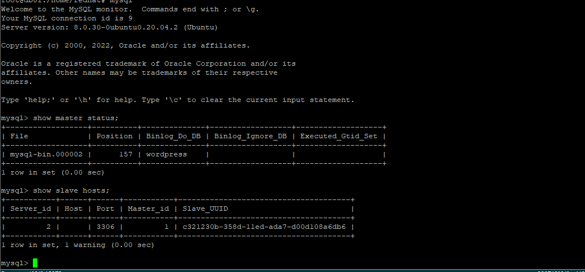
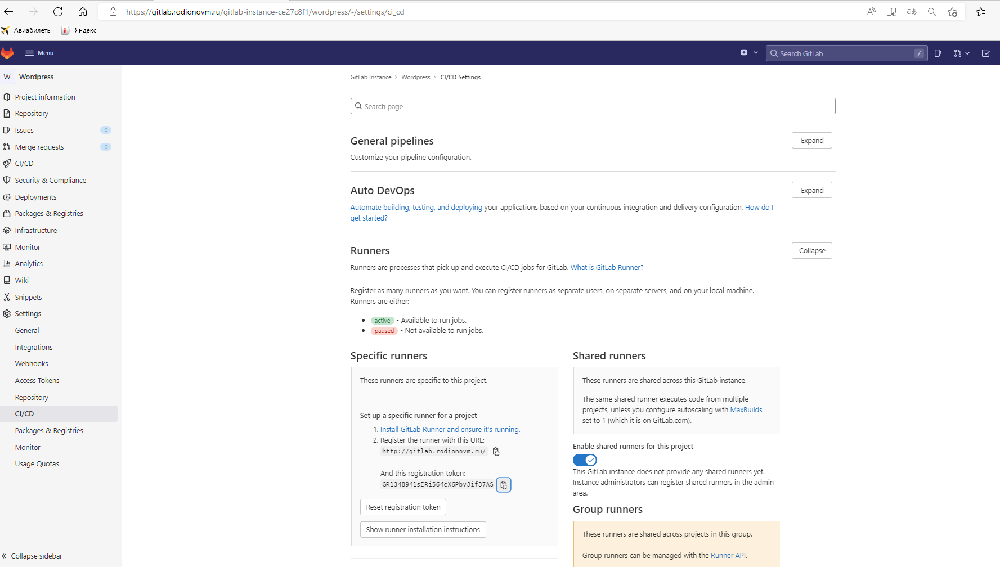

## Дипломный практикум в YandexCloud

**Цели:**

1. Зарегистрировать доменное имя (любое на ваш выбор в любой доменной зоне).
2. Подготовить инфраструктуру с помощью Terraform на базе облачного провайдера YandexCloud.
3. Настроить внешний Reverse Proxy на основе Nginx и LetsEncrypt.
4. Настроить кластер MySQL.
5. Установить WordPress.
6. Развернуть Gitlab CE и Gitlab Runner.
7. Настроить CI/CD для автоматического развёртывания приложения.
8. Настроить мониторинг инфраструктуры с помощью стека: Prometheus, Alert Manager и Grafana.

### **Этапы выполнения:**

***1. Регистрация доменного имени***

Подойдет любое доменное имя на ваш выбор в любой доменной зоне.
ПРИМЕЧАНИЕ: Далее в качестве примера используется домен `you.domain` замените его вашим доменом.
Рекомендуемые регистраторы:

• [nic.ru](https://www.nic.ru/)
• [reg.ru](https://www.reg.ru/)

*Цель:*

1. Получить возможность выписывать [TLS сертификаты](https://letsencrypt.org/) для веб-сервера.

*Ожидаемые результаты:*

1. У вас есть доступ к личному кабинету на сайте регистратора.
2. Вы зарезистрировали домен и можете им управлять (редактировать dns записи в рамках этого домена).

```
Ответ:
Было зарегистрировано доменное имя: rodionovm.ru в регистраторе reg.ru
Возможность прописывать dns записи и редактировать ААА записи:
```


```
Ответ:
В YandexCloud арендован статический адрес для проекта
```


***2. Создание инфраструктуры***

Для начала необходимо подготовить инфраструктуру в YC при помощи [Terraform](https://www.terraform.io/).

*Особенности выполнения:*

* Бюджет купона ограничен, что следует иметь в виду при проектировании инфраструктуры и использовании ресурсов;
* Следует использовать последнюю стабильную версию Terraform.

*Предварительная подготовка:*

1. Создайте сервисный аккаунт, который будет в дальнейшем использоваться Terraform для работы с инфраструктурой с необходимыми и достаточными правами. Не стоит использовать права суперпользователя
2. Подготовьте [backend](https://www.terraform.io/language/settings/backends) для Terraform:

а. Рекомендуемый вариант: [Terraform Cloud](https://app.terraform.io/)
б. Альтернативный вариант: S3 bucket в созданном YC аккаунте.

```
Ответ:
Выбран вариант с S3 bucket в YC
```


3. Настройте [workspaces](https://www.terraform.io/language/state/workspaces)

а. Рекомендуемый вариант: создайте два workspace: *stage* и  *prod* . В случае выбора этого варианта все последующие шаги должны учитывать факт существования нескольких workspace.
б. Альтернативный вариант: используйте один workspace, назвав его  *stage* . Пожалуйста, не используйте workspace, создаваемый Terraform-ом по-умолчанию (default).
```
Ответ:
Выбран вариант с 2 workspace stage и prod
```


4. Создайте VPC с подсетями в разных зонах доступности.
5. Убедитесь, что теперь вы можете выполнить команды `terraform destroy` и `terraform apply` без дополнительных ручных действий.
6. В случае использования [Terraform Cloud](https://app.terraform.io/) в качестве [backend](https://www.terraform.io/language/settings/backends) убедитесь, что применение изменений успешно проходит, используя web-интерфейс Terraform cloud.

*Цель:*

1. Повсеместно применять IaaC подход при организации (эксплуатации) инфраструктуры.
2. Иметь возможность быстро создавать (а также удалять) виртуальные машины и сети. С целью экономии денег на вашем аккаунте в YandexCloud.

*Ожидаемые результаты:*

1. Terraform сконфигурирован и создание инфраструктуры посредством Terraform возможно без дополнительных ручных действий.
2. Полученная конфигурация инфраструктуры является предварительной, поэтому в ходе дальнейшего выполнения задания возможны изменения.

---
[Terraform](./terraform)
```
Ответ: 
- meta.txt - Пользовател и открытый ключ;
- gitlab.tf - gitlab манифест для создания виртуальной машины в YC.
- runner.tf - gitlab-runner манифест для создания виртуальной машины в YC.
- wordpress.tf - wordpress манифест для создания виртуальной машины в YC.
- nginx.tf - nginx манифест для создания виртуальной машины в YC.
- monitoring.tf - monitoring манифест для создания виртуальной машины в YC.
- mysql.tf - mysql манифест для создания виртуальной машины в YC для базы данных.
- network.tf - настройки сетей.
- providers.tf - настройки для подключения к провайдеру.
- variables.tf - external ip адрес.
```


***3. Установка Nginx и LetsEncrypt***

Необходимо разработать Ansible роль для установки Nginx и LetsEncrypt.
Для получения LetsEncrypt сертификатов во время тестов своего кода пользуйтесь [тестовыми сертификатами](https://letsencrypt.org/docs/staging-environment/), так как количество запросов к боевым серверам LetsEncrypt [лимитировано](https://letsencrypt.org/docs/rate-limits/).

*Рекомендации:*

• Имя сервера: `you.domain`
• Характеристики: 2vCPU, 2 RAM, External address (Public) и Internal address.

*Цель:*

1. Создать reverse proxy с поддержкой TLS для обеспечения безопасного доступа к веб-сервисам по HTTPS.

*Ожидаемые результаты:*

1. В вашей доменной зоне настроены все A-записи на внешний адрес этого сервера:

* `https://www.you.domain` (WordPress)
* `https://gitlab.you.domain` (Gitlab)
* `https://grafana.you.domain` (Grafana)
* `https://prometheus.you.domain` (Prometheus)
* `https://alertmanager.you.domain` (Alert Manager)

3. Настроены все upstream для выше указанных URL, куда они сейчас ведут на этом шаге не важно, позже вы их отредактируете и укажите верные значения.
4. В браузере можно открыть любой из этих URL и увидеть ответ сервера (502 Bad Gateway). На текущем этапе выполнение задания это нормально!

---

```
Ответ: 
Все роли находятся в ansible и разделены по сервисам. 
В файле hosts находится inventory для playbook и переменные для ansible ssh proxy.
В рамках текущего шага выполняем playbook nginx.yml. 
Он установит и настроит nginx, letsEncrypt на nginx машину.
```


<details><summary>Ansible</summary>

``` 
vagrant@server1:~/ansible/diplom/ansible$ ansible-playbook nginx.yml -i hosts

PLAY [nginx] **************************************************************************************************************************************************************

TASK [Gathering Facts] ****************************************************************************************************************************************************
ok: [rodionovm.ru]

TASK [install_nginx_letsencrypt : Upgrade system] *************************************************************************************************************************
changed: [rodionovm.ru]

TASK [install_nginx_letsencrypt : Install nginx] **************************************************************************************************************************
changed: [rodionovm.ru]

TASK [install_nginx_letsencrypt : install letsencrypt] ********************************************************************************************************************
changed: [rodionovm.ru]

TASK [install_nginx_letsencrypt : create letsencrypt directory] ***********************************************************************************************************
changed: [rodionovm.ru]

TASK [install_nginx_letsencrypt : Remove default nginx config] ************************************************************************************************************
changed: [rodionovm.ru]

TASK [install_nginx_letsencrypt : Install system nginx config] ************************************************************************************************************
changed: [rodionovm.ru]

TASK [install_nginx_letsencrypt : Install nginx site for letsencrypt requests] ********************************************************************************************
changed: [rodionovm.ru]

TASK [install_nginx_letsencrypt : Reload nginx to activate letsencrypt site] **********************************************************************************************
changed: [rodionovm.ru]

TASK [install_nginx_letsencrypt : Create letsencrypt certificate nginx] ***************************************************************************************************
changed: [rodionovm.ru]

TASK [install_nginx_letsencrypt : Create letsencrypt certificate gitlab] **************************************************************************************************
changed: [rodionovm.ru]

TASK [install_nginx_letsencrypt : Create letsencrypt certificate grafana] *************************************************************************************************
changed: [rodionovm.ru]

TASK [install_nginx_letsencrypt : Create letsencrypt certificate prometheus] **********************************************************************************************
changed: [rodionovm.ru]

TASK [install_nginx_letsencrypt : Create letsencrypt certificate alertmanager] ********************************************************************************************
changed: [rodionovm.ru]

TASK [install_nginx_letsencrypt : Generate dhparams] **********************************************************************************************************************
changed: [rodionovm.ru]

TASK [install_nginx_letsencrypt : Install nginx site for specified site] **************************************************************************************************
changed: [rodionovm.ru]

TASK [install_nginx_letsencrypt : Reload nginx to activate specified site] ************************************************************************************************
changed: [rodionovm.ru]

TASK [install_nginx_letsencrypt : Add letsencrypt cronjob for cert renewal] ***********************************************************************************************
changed: [rodionovm.ru]

TASK [install_proxy : install privoxy] ************************************************************************************************************************************
changed: [rodionovm.ru]

TASK [install_proxy : configure privoxy] **********************************************************************************************************************************
changed: [rodionovm.ru]

TASK [install_proxy : start privoxy] **************************************************************************************************************************************
ok: [rodionovm.ru]

TASK [install_node_exporter : Assert usage of systemd as an init system] **************************************************************************************************
ok: [rodionovm.ru] => {
    "changed": false,
    "msg": "All assertions passed"
}

TASK [install_node_exporter : Get systemd version] ************************************************************************************************************************
ok: [rodionovm.ru]

TASK [install_node_exporter : Set systemd version fact] *******************************************************************************************************************
ok: [rodionovm.ru]

TASK [install_node_exporter : Naive assertion of proper listen address] ***************************************************************************************************
ok: [rodionovm.ru] => {
    "changed": false,
    "msg": "All assertions passed"
}

TASK [install_node_exporter : Assert collectors are not both disabled and enabled at the same time] ***********************************************************************

TASK [install_node_exporter : Assert that TLS key and cert path are set] **************************************************************************************************
skipping: [rodionovm.ru]

TASK [install_node_exporter : Check existence of TLS cert file] ***********************************************************************************************************
skipping: [rodionovm.ru]

TASK [install_node_exporter : Check existence of TLS key file] ************************************************************************************************************
skipping: [rodionovm.ru]

TASK [install_node_exporter : Assert that TLS key and cert are present] ***************************************************************************************************
skipping: [rodionovm.ru]

TASK [install_node_exporter : Check if node_exporter is installed] ********************************************************************************************************
ok: [rodionovm.ru]

TASK [install_node_exporter : Gather currently installed node_exporter version (if any)] **********************************************************************************
skipping: [rodionovm.ru]

TASK [install_node_exporter : Get latest release] *************************************************************************************************************************
skipping: [rodionovm.ru]

TASK [install_node_exporter : Set node_exporter version to {{ _latest_release.json.tag_name[1:] }}] ***********************************************************************
skipping: [rodionovm.ru]

TASK [install_node_exporter : Get checksum list from github] **************************************************************************************************************
ok: [rodionovm.ru -> localhost]

TASK [install_node_exporter : Get checksum for amd64 architecture] ********************************************************************************************************
skipping: [rodionovm.ru] => (item=3919266f1dbad5f7e5ce7b4207057fc253a8322f570607cc0f3e73f4a53338e3  node_exporter-1.1.2.darwin-amd64.tar.gz)
skipping: [rodionovm.ru] => (item=5b0195e203dedd3a8973cd1894a55097554a4af6d8f4f0614c2c67d6670ea8ae  node_exporter-1.1.2.linux-386.tar.gz)
ok: [rodionovm.ru -> localhost] => (item=8c1f6a317457a658e0ae68ad710f6b4098db2cad10204649b51e3c043aa3e70d  node_exporter-1.1.2.linux-amd64.tar.gz)
skipping: [rodionovm.ru] => (item=eb5e7d16f18bb3272d0d832986fc8ac6cb0b6c42d487c94e15dabb10feae8e04  node_exporter-1.1.2.linux-arm64.tar.gz)
skipping: [rodionovm.ru] => (item=41892e451e80160491a1cc7bbe6bccd6cb842ae8340e1bc6e32f72cefb1aee80  node_exporter-1.1.2.linux-armv5.tar.gz)
skipping: [rodionovm.ru] => (item=1cc1bf4cacb84d6c228d9ce8045b5b00b73afd954046f7b2add428a04d14daee  node_exporter-1.1.2.linux-armv6.tar.gz)
skipping: [rodionovm.ru] => (item=a9fe816eb7b976b1587d6d654c437f7d78349f70686fa22ae33e94fe84281af2  node_exporter-1.1.2.linux-armv7.tar.gz)
skipping: [rodionovm.ru] => (item=a99ab2cdc62db25ff01d184e21ad433e3949cd791fc2c80b6bacc6b90d5a62c2  node_exporter-1.1.2.linux-mips.tar.gz)
skipping: [rodionovm.ru] => (item=22d9c2a5363502c79e0645ba02eafd9561b33d1e0e819ce4df3fcf7dc96e3792  node_exporter-1.1.2.linux-mips64.tar.gz)
skipping: [rodionovm.ru] => (item=a66b70690c3c4fff953905a041c74834f96be85a806e74a1cc925e607ef50a26  node_exporter-1.1.2.linux-mips64le.tar.gz)
skipping: [rodionovm.ru] => (item=f7fba791cbc758b021d0e9a2400c82d1f29337e568ab00edc84b053ca467ea3c  node_exporter-1.1.2.linux-mipsle.tar.gz)
skipping: [rodionovm.ru] => (item=294c0b05dff4f368512449de7268e3f06de679a9343e9885044adc702865080b  node_exporter-1.1.2.linux-ppc64.tar.gz)
skipping: [rodionovm.ru] => (item=d1d201b16d757980db654bb9e448ab0c81ca4c2715243c3fa4305bef5967bd41  node_exporter-1.1.2.linux-ppc64le.tar.gz)
skipping: [rodionovm.ru] => (item=6007420f425d08626c05de2dbe0e8bb785a16bba1b02c01cb06d37d7fab3bc97  node_exporter-1.1.2.linux-s390x.tar.gz)
skipping: [rodionovm.ru] => (item=0596e9c1cc358e6fcc60cb83f0d1ba9a37ccee11eca035429c9791c0beb04389  node_exporter-1.1.2.netbsd-386.tar.gz)
skipping: [rodionovm.ru] => (item=46c964efd336f0e35f62c739ce9edf5409911e7652604e411c9b684eb9c48386  node_exporter-1.1.2.netbsd-amd64.tar.gz)
skipping: [rodionovm.ru] => (item=d81f86f57a4ed167a4062aa47f8a70b35c146c86bc8e40924c9d1fc3644ec8e6  node_exporter-1.1.2.openbsd-amd64.tar.gz)

TASK [install_node_exporter : Create the node_exporter group] *************************************************************************************************************
changed: [rodionovm.ru]

TASK [install_node_exporter : Create the node_exporter user] **************************************************************************************************************
changed: [rodionovm.ru]

TASK [install_node_exporter : Download node_exporter binary to local folder] **********************************************************************************************
ok: [rodionovm.ru -> localhost]

TASK [install_node_exporter : Unpack node_exporter binary] ****************************************************************************************************************
skipping: [rodionovm.ru]

TASK [install_node_exporter : Propagate node_exporter binaries] ***********************************************************************************************************
changed: [rodionovm.ru]

TASK [install_node_exporter : propagate locally distributed node_exporter binary] *****************************************************************************************
skipping: [rodionovm.ru]

TASK [install_node_exporter : Install selinux python packages [RHEL]] *****************************************************************************************************
skipping: [rodionovm.ru]

TASK [install_node_exporter : Install selinux python packages [Fedora]] ***************************************************************************************************
skipping: [rodionovm.ru]

TASK [install_node_exporter : Install selinux python packages [clearlinux]] ***********************************************************************************************
skipping: [rodionovm.ru]

TASK [install_node_exporter : Copy the node_exporter systemd service file] ************************************************************************************************
changed: [rodionovm.ru]

TASK [install_node_exporter : Create node_exporter config directory] ******************************************************************************************************
skipping: [rodionovm.ru]

TASK [install_node_exporter : Copy the node_exporter config file] *********************************************************************************************************
skipping: [rodionovm.ru]

TASK [install_node_exporter : Create textfile collector dir] **************************************************************************************************************
changed: [rodionovm.ru]

TASK [install_node_exporter : Allow node_exporter port in SELinux on RedHat OS family] ************************************************************************************
skipping: [rodionovm.ru]

TASK [install_node_exporter : Ensure Node Exporter is enabled on boot] ****************************************************************************************************
changed: [rodionovm.ru]

RUNNING HANDLER [install_proxy : restart privoxy] *************************************************************************************************************************
changed: [rodionovm.ru]

RUNNING HANDLER [install_node_exporter : restart node_exporter] ***********************************************************************************************************
changed: [rodionovm.ru]

PLAY RECAP ****************************************************************************************************************************************************************
rodionovm.ru               : ok=37   changed=27   unreachable=0    failed=0    skipped=16   rescued=0    ignored=0 
```
</details>

**4. Установка кластера MySQL**

Необходимо разработать Ansible роль для установки кластера MySQL.

*Рекомендации:*

• Имена серверов: `db01.you.domain` и `db02.you.domain`
• Характеристики: 4vCPU, 4 RAM, Internal address.

*Цель:*

1. Получить отказоустойчивый кластер баз данных MySQL.

*Ожидаемые результаты:*

1. MySQL работает в режиме репликации Master/Slave.
2. В кластере автоматически создаётся база данных c именем `wordpress`.
3. В кластере автоматически создаётся пользователь `wordpress` с полными правами на базу `wordpress` и паролем `wordpress`.

*Вы должны понимать, что в рамках обучения это допустимые значения, но в боевой среде использование подобных значений не приемлимо! Считается хорошей практикой использовать логины и пароли повышенного уровня сложности. В которых будут содержаться буквы верхнего и нижнего регистров, цифры, а также специальные символы!*

---

```
Ответ: 

На nginx настроен stream для отказоустойчивости

stream {
  upstream db {
    server db01.rodionovm.ru:3306 weight=100;
    server db02.rodionovm.ru:3306;
 }

  server {
    listen 3306;
    proxy_pass db;
  }
}


Решение с гитхаба - https://github.com/geerlingguy/ansible-role-mysql (изначально не работало, позже нашел причину - PR #495: Whitespace issue)
Выполняем playbook mysql.yml.
Настройки на базу данных находятся в ansible/roles/install_mysql/defaults/main.yml

# Databases.
mysql_databases: 
   - name: wordpress
     collation: utf8_general_ci
     encoding: utf8
     replicate: 1

# Users.
mysql_users: 
   - name: wordpress
     host: '%'
     password: wordpress
     priv: '*.*:ALL PRIVILEGES'

   - name: repuser
     password: repuser
     priv: '*.*:CREATE USER,RELOAD,REPLICATION SLAVE,REPLICATION CLIENT,REPLICATION_SLAVE_ADMIN'

Дополнительно в файле `hosts` передаются переменные для настройки репликации баз
```


<details><summary>Ansible</summary>

```
vagrant@server1:~/ansible/diplom/ansible$ ansible-playbook mysql.yml -i hosts

PLAY [mysql] **************************************************************************************************************************************************************

TASK [Gathering Facts] ****************************************************************************************************************************************************
The authenticity of host 'db01.rodionovm.ru (<no hostip for proxy command>)' can't be established.
ECDSA key fingerprint is SHA256:qWl/vRzMaUj25Moi/x+M6iuyvKm1T/+2P9ItLTOTP6Q.
The authenticity of host 'db02.rodionovm.ru (<no hostip for proxy command>)' can't be established.
ECDSA key fingerprint is SHA256:2+63JS0puyg0DPPl2csnObIc80511i5Kt+CVfRbqbok.
Are you sure you want to continue connecting (yes/no/[fingerprint])? yes
yes
ok: [db02.rodionovm.ru]
ok: [db01.rodionovm.ru]

TASK [install_mysql : include_tasks] **************************************************************************************************************************************
included: /home/vagrant/ansible/diplom/ansible/roles/install_mysql/tasks/variables.yml for db01.rodionovm.ru, db02.rodionovm.ru

TASK [install_mysql : Include OS-specific variables.] *********************************************************************************************************************
ok: [db01.rodionovm.ru] => (item=/home/vagrant/ansible/diplom/ansible/roles/install_mysql/vars/Debian.yml)
ok: [db02.rodionovm.ru] => (item=/home/vagrant/ansible/diplom/ansible/roles/install_mysql/vars/Debian.yml)

TASK [install_mysql : Define mysql_packages.] *****************************************************************************************************************************
ok: [db01.rodionovm.ru]
ok: [db02.rodionovm.ru]

TASK [install_mysql : Define mysql_daemon.] *******************************************************************************************************************************
ok: [db01.rodionovm.ru]
ok: [db02.rodionovm.ru]

TASK [install_mysql : Define mysql_slow_query_log_file.] ******************************************************************************************************************
ok: [db01.rodionovm.ru]
ok: [db02.rodionovm.ru]

TASK [install_mysql : Define mysql_log_error.] ****************************************************************************************************************************
ok: [db01.rodionovm.ru]
ok: [db02.rodionovm.ru]

TASK [install_mysql : Define mysql_syslog_tag.] ***************************************************************************************************************************
ok: [db01.rodionovm.ru]
ok: [db02.rodionovm.ru]

TASK [install_mysql : Define mysql_pid_file.] *****************************************************************************************************************************
ok: [db01.rodionovm.ru]
ok: [db02.rodionovm.ru]

TASK [install_mysql : Define mysql_config_file.] **************************************************************************************************************************
ok: [db01.rodionovm.ru]
ok: [db02.rodionovm.ru]

TASK [install_mysql : Define mysql_config_include_dir.] *******************************************************************************************************************
ok: [db01.rodionovm.ru]
ok: [db02.rodionovm.ru]

TASK [install_mysql : Define mysql_socket.] *******************************************************************************************************************************
ok: [db01.rodionovm.ru]
ok: [db02.rodionovm.ru]

TASK [install_mysql : Define mysql_supports_innodb_large_prefix.] *********************************************************************************************************
ok: [db01.rodionovm.ru]
ok: [db02.rodionovm.ru]

TASK [install_mysql : include_tasks] **************************************************************************************************************************************
skipping: [db01.rodionovm.ru]
skipping: [db02.rodionovm.ru]

TASK [install_mysql : include_tasks] **************************************************************************************************************************************
included: /home/vagrant/ansible/diplom/ansible/roles/install_mysql/tasks/setup-Debian.yml for db01.rodionovm.ru, db02.rodionovm.ru

TASK [install_mysql : Check if MySQL is already installed.] ***************************************************************************************************************
ok: [db02.rodionovm.ru]
ok: [db01.rodionovm.ru]

TASK [install_mysql : Update apt cache if MySQL is not yet installed.] ****************************************************************************************************
ok: [db01.rodionovm.ru]
ok: [db02.rodionovm.ru]

TASK [install_mysql : Ensure MySQL Python libraries are installed.] *******************************************************************************************************
changed: [db02.rodionovm.ru]
changed: [db01.rodionovm.ru]

TASK [install_mysql : Ensure MySQL packages are installed.] ***************************************************************************************************************
changed: [db01.rodionovm.ru]
changed: [db02.rodionovm.ru]

TASK [install_mysql : Ensure MySQL is stopped after initial install.] *****************************************************************************************************
changed: [db02.rodionovm.ru]
changed: [db01.rodionovm.ru]

TASK [install_mysql : Delete innodb log files created by apt package after initial install.] ******************************************************************************
ok: [db01.rodionovm.ru] => (item=ib_logfile0)
ok: [db02.rodionovm.ru] => (item=ib_logfile0)
ok: [db01.rodionovm.ru] => (item=ib_logfile1)
ok: [db02.rodionovm.ru] => (item=ib_logfile1)

TASK [install_mysql : include_tasks] **************************************************************************************************************************************
skipping: [db01.rodionovm.ru]
skipping: [db02.rodionovm.ru]

TASK [install_mysql : Check if MySQL packages were installed.] ************************************************************************************************************
ok: [db01.rodionovm.ru]
ok: [db02.rodionovm.ru]

TASK [install_mysql : include_tasks] **************************************************************************************************************************************
included: /home/vagrant/ansible/diplom/ansible/roles/install_mysql/tasks/configure.yml for db01.rodionovm.ru, db02.rodionovm.ru

TASK [install_mysql : Get MySQL version.] *********************************************************************************************************************************
ok: [db01.rodionovm.ru]
ok: [db02.rodionovm.ru]

TASK [install_mysql : Copy my.cnf global MySQL configuration.] ************************************************************************************************************
changed: [db02.rodionovm.ru]
changed: [db01.rodionovm.ru]

TASK [install_mysql : Verify mysql include directory exists.] *************************************************************************************************************
skipping: [db01.rodionovm.ru]
skipping: [db02.rodionovm.ru]

TASK [install_mysql : Copy my.cnf override files into include directory.] *************************************************************************************************

TASK [install_mysql : Create slow query log file (if configured).] ********************************************************************************************************
skipping: [db01.rodionovm.ru]
skipping: [db02.rodionovm.ru]

TASK [install_mysql : Create datadir if it does not exist] ****************************************************************************************************************
changed: [db01.rodionovm.ru]
changed: [db02.rodionovm.ru]

TASK [install_mysql : Set ownership on slow query log file (if configured).] **********************************************************************************************
skipping: [db01.rodionovm.ru]
skipping: [db02.rodionovm.ru]

TASK [install_mysql : Create error log file (if configured).] *************************************************************************************************************
skipping: [db01.rodionovm.ru]
skipping: [db02.rodionovm.ru]

TASK [install_mysql : Set ownership on error log file (if configured).] ***************************************************************************************************
skipping: [db01.rodionovm.ru]
skipping: [db02.rodionovm.ru]

TASK [install_mysql : Ensure MySQL is started and enabled on boot.] *******************************************************************************************************
changed: [db01.rodionovm.ru]
changed: [db02.rodionovm.ru]

TASK [install_mysql : include_tasks] **************************************************************************************************************************************
included: /home/vagrant/ansible/diplom/ansible/roles/install_mysql/tasks/secure-installation.yml for db01.rodionovm.ru, db02.rodionovm.ru

TASK [install_mysql : Ensure default user is present.] ********************************************************************************************************************
changed: [db01.rodionovm.ru]
changed: [db02.rodionovm.ru]

TASK [install_mysql : Copy user-my.cnf file with password credentials.] ***************************************************************************************************
changed: [db01.rodionovm.ru]
changed: [db02.rodionovm.ru]

TASK [install_mysql : Disallow root login remotely] ***********************************************************************************************************************
ok: [db02.rodionovm.ru] => (item=DELETE FROM mysql.user WHERE User='root' AND Host NOT IN ('localhost', '127.0.0.1', '::1'))
ok: [db01.rodionovm.ru] => (item=DELETE FROM mysql.user WHERE User='root' AND Host NOT IN ('localhost', '127.0.0.1', '::1'))

TASK [install_mysql : Get list of hosts for the root user.] ***************************************************************************************************************
ok: [db01.rodionovm.ru]
ok: [db02.rodionovm.ru]

TASK [install_mysql : Update MySQL root password for localhost root account (5.7.x).] *************************************************************************************
changed: [db02.rodionovm.ru] => (item=localhost)
changed: [db01.rodionovm.ru] => (item=localhost)

TASK [install_mysql : Update MySQL root password for localhost root account (< 5.7.x).] ***********************************************************************************
skipping: [db01.rodionovm.ru] => (item=localhost)
skipping: [db02.rodionovm.ru] => (item=localhost)

TASK [install_mysql : Copy .my.cnf file with root password credentials.] **************************************************************************************************
changed: [db01.rodionovm.ru]
changed: [db02.rodionovm.ru]

TASK [install_mysql : Get list of hosts for the anonymous user.] **********************************************************************************************************
ok: [db01.rodionovm.ru]
ok: [db02.rodionovm.ru]

TASK [install_mysql : Remove anonymous MySQL users.] **********************************************************************************************************************

TASK [install_mysql : Remove MySQL test database.] ************************************************************************************************************************
ok: [db01.rodionovm.ru]
ok: [db02.rodionovm.ru]

TASK [install_mysql : include_tasks] **************************************************************************************************************************************
included: /home/vagrant/ansible/diplom/ansible/roles/install_mysql/tasks/databases.yml for db01.rodionovm.ru, db02.rodionovm.ru

TASK [install_mysql : Ensure MySQL databases are present.] ****************************************************************************************************************
changed: [db01.rodionovm.ru] => (item={'name': 'wordpress', 'collation': 'utf8_general_ci', 'encoding': 'utf8', 'replicate': 1})
changed: [db02.rodionovm.ru] => (item={'name': 'wordpress', 'collation': 'utf8_general_ci', 'encoding': 'utf8', 'replicate': 1})

TASK [install_mysql : include_tasks] **************************************************************************************************************************************
included: /home/vagrant/ansible/diplom/ansible/roles/install_mysql/tasks/users.yml for db01.rodionovm.ru, db02.rodionovm.ru

TASK [install_mysql : Ensure MySQL users are present.] ********************************************************************************************************************
changed: [db01.rodionovm.ru] => (item=None)
changed: [db02.rodionovm.ru] => (item=None)
changed: [db01.rodionovm.ru] => (item=None)
changed: [db01.rodionovm.ru]
changed: [db02.rodionovm.ru] => (item=None)
changed: [db02.rodionovm.ru]

TASK [install_mysql : include_tasks] **************************************************************************************************************************************
included: /home/vagrant/ansible/diplom/ansible/roles/install_mysql/tasks/replication.yml for db01.rodionovm.ru, db02.rodionovm.ru

TASK [install_mysql : Ensure replication user exists on master.] **********************************************************************************************************
skipping: [db02.rodionovm.ru]
changed: [db01.rodionovm.ru]

TASK [install_mysql : Check slave replication status.] ********************************************************************************************************************
skipping: [db01.rodionovm.ru]
ok: [db02.rodionovm.ru]

TASK [install_mysql : Check master replication status.] **************************************************************************************************************************************************************************************************
skipping: [db01.rodionovm.ru]
ok: [db02.rodionovm.ru -> db01.rodionovm.ru]

TASK [install_mysql : Configure replication on the slave.] ***********************************************************************************************************************************************************************************************
skipping: [db01.rodionovm.ru]
changed: [db02.rodionovm.ru]

TASK [install_mysql : Start replication.] ****************************************************************************************************************************************************************************************************************
skipping: [db01.rodionovm.ru]
changed: [db02.rodionovm.ru]

RUNNING HANDLER [install_mysql : restart mysql] ***************************************************************************************************************************
[WARNING]: Ignoring "sleep" as it is not used in "systemd"
[WARNING]: Ignoring "sleep" as it is not used in "systemd"
changed: [db02.rodionovm.ru]
changed: [db01.rodionovm.ru]

PLAY RECAP ****************************************************************************************************************************************************************
db01.rodionovm.ru          : ok=42   changed=15   unreachable=0    failed=0    skipped=14   rescued=0    ignored=0
db02.rodionovm.ru          : ok=45   changed=16   unreachable=0    failed=0    skipped=11   rescued=0    ignored=0

```

</details>


**5. Установка WordPress**

Необходимо разработать Ansible роль для установки WordPress.

*Рекомендации:*

• Имя сервера: `app.you.domain`
• Характеристики: 4vCPU, 4 RAM, Internal address.

*Цель:*

1. Установить [WordPress](https://wordpress.org/download/). Это система управления содержимым сайта ([CMS](https://ru.wikipedia.org/wiki/%D0%A1%D0%B8%D1%81%D1%82%D0%B5%D0%BC%D0%B0_%D1%83%D0%BF%D1%80%D0%B0%D0%B2%D0%BB%D0%B5%D0%BD%D0%B8%D1%8F_%D1%81%D0%BE%D0%B4%D0%B5%D1%80%D0%B6%D0%B8%D0%BC%D1%8B%D0%BC)) с открытым исходным кодом.

По данным W3techs, WordPress используют 64,7% всех веб-сайтов, которые сделаны на CMS. Это 41,1% всех существующих в мире сайтов. Эту платформу для своих блогов используют The New York Times и Forbes. Такую популярность WordPress получил за удобство интерфейса и большие возможности.

*Ожидаемые результаты:*

1. Виртуальная машина на которой установлен WordPress и Nginx/Apache (на ваше усмотрение).
2. В вашей доменной зоне настроена A-запись на внешний адрес reverse proxy:

* `https://www.you.domain` (WordPress)

3. На сервере `you.domain` отредактирован upstream для выше указанного URL и он смотрит на виртуальную машину на которой установлен WordPress.
4. В браузере можно открыть URL `https://www.you.domain` и увидеть главную страницу WordPress.

---

```
Ответ: 
Для установки `WordPress` служит playbook `wordpress.yml`.  
Playbook устанавливает и настраивает `nginx`,  `php`, `wordpress`. 
В файле `wordpress.yml` так же передаются переменные, необходимые для корректной настройки wordpress.
В роли так же копируется 2 файла:
--- wp-config.php - большой надобности в нем нет, нужен из-за: 
    define('WP_HOME','https://rodionovm.ru');
    define('WP_SITEURL','https://rodionovm.ru');
    $_SERVER['HTTPS'] = 'on';

--- .gitignore - для исключения файлов


- name: unpack WordPress installation
  shell: "tar xvfz /tmp/latest.tar.gz -C {{ wpdirectory }} && chown -R www-data:www-data {{ wpdirectory }}"

- name: install wordpress configuration
  template:
    src: wp-config.php
    dest: /var/www/wordpress/wp-config.php

- name: copy gitignore
  template:
    src: .gitignore
    dest: /var/www/wordpress/.gitignore


При установке wordpress:
username/pwd/database - wordpress
db_host - rodionovm.ru

(gitignore для файла https://github.com/github/gitignore/blob/main/WordPress.gitignore).
  
```


<details><summary>Ansible</summary>

```
vagrant@server1:~/ansible/diplom/ansible$ ansible-playbook wordpress.yml -i hosts

PLAY [app] ****************************************************************************************************************************************************************

TASK [Gathering Facts] ****************************************************************************************************************************************************
The authenticity of host 'app.rodionovm.ru (<no hostip for proxy command>)' can't be established.
ECDSA key fingerprint is SHA256:aWfsELzs8E2nYR1OQuS8FSdSNFQInrSNuPL9bQ3ja5I.
Are you sure you want to continue connecting (yes/no/[fingerprint])? yes
ok: [app.rodionovm.ru]

TASK [nginx : Add nginx repository] ***************************************************************************************************************************************
changed: [app.rodionovm.ru]

TASK [nginx : Install nginx] **********************************************************************************************************************************************
changed: [app.rodionovm.ru]

TASK [nginx : Disable default site] ***************************************************************************************************************************************
changed: [app.rodionovm.ru]

TASK [php : Upgrade system] ***********************************************************************************************************************************************
ok: [app.rodionovm.ru]

TASK [php : install php7.4] ***********************************************************************************************************************************************
changed: [app.rodionovm.ru] => (item=php7.4)
changed: [app.rodionovm.ru] => (item=php7.4-cgi)
changed: [app.rodionovm.ru] => (item=php-fpm)
changed: [app.rodionovm.ru] => (item=php7.4-memcache)
changed: [app.rodionovm.ru] => (item=php7.4-memcached)
changed: [app.rodionovm.ru] => (item=php7.4-mysql)
changed: [app.rodionovm.ru] => (item=php7.4-gd)
changed: [app.rodionovm.ru] => (item=php7.4-curl)
changed: [app.rodionovm.ru] => (item=php7.4-xmlrpc)

TASK [php : change listen socket] *****************************************************************************************************************************************
changed: [app.rodionovm.ru]

TASK [wordpress : Install git] ********************************************************************************************************************************************
ok: [app.rodionovm.ru]

TASK [wordpress : install nginx configuration] ****************************************************************************************************************************
changed: [app.rodionovm.ru]

TASK [wordpress : activate site configuration] ****************************************************************************************************************************
changed: [app.rodionovm.ru]

TASK [wordpress : download WordPress] *************************************************************************************************************************************
changed: [app.rodionovm.ru]

TASK [wordpress : creating directory for WordPress] ***********************************************************************************************************************
changed: [app.rodionovm.ru]

TASK [wordpress : unpack WordPress installation] **************************************************************************************************************************
changed: [app.rodionovm.ru]

TASK [wordpress : install wordpress configuration] ************************************************************************************************************************
changed: [app.rodionovm.ru]

TASK [wordpress : copy gitignore] *****************************************************************************************************************************************
changed: [app.rodionovm.ru]

TASK [wordpress : wordpress php] ******************************************************************************************************************************************
changed: [app.rodionovm.ru]

TASK [wordpress : chmod to www-data on wordpress dir] *********************************************************************************************************************
changed: [app.rodionovm.ru]

RUNNING HANDLER [nginx : restart nginx] ***********************************************************************************************************************************
changed: [app.rodionovm.ru]

RUNNING HANDLER [php : restart php-fpm] ***********************************************************************************************************************************
changed: [app.rodionovm.ru]

PLAY RECAP ****************************************************************************************************************************************************************
app.rodionovm.ru           : ok=19   changed=16   unreachable=0    failed=0    skipped=0    rescued=0    ignored=0
```
</details>

<details><summary>Test BD</summary>

```
Проверим доступность сайта при остановке Master сервера (о том, что репликация новых данных со slave не пройдет при поднятии mastera речи не идет, это уже другая история)

  yc compute instance get db01
id: fhmn4umrbusmjbuigama
folder_id: b1g2ut3jveotvs3u28g9
created_at: "2022-09-13T05:30:43Z"
name: db01
zone_id: ru-central1-a
platform_id: standard-v1
resources:
  memory: "4294967296"
  cores: "4"
  core_fraction: "100"
***status: STOPPED***
fqdn: db01.rodionovm.ru


vagrant@server1:~/ansible/diplom/ansible$ mysql -u wordpress -p -h rodionovm.ru
Enter password:
Welcome to the MySQL monitor.  Commands end with ; or \g.
Your MySQL connection id is 55
Server version: 8.0.30-0ubuntu0.20.04.2 (Ubuntu)

Copyright (c) 2000, 2022, Oracle and/or its affiliates.

Oracle is a registered trademark of Oracle Corporation and/or its
affiliates. Other names may be trademarks of their respective
owners.

Type 'help;' or '\h' for help. Type '\c' to clear the current input statement.

mysql> show databases;
+--------------------+
| Database           |
+--------------------+
| information_schema |
| mysql              |
| performance_schema |
| sys                |
| wordpress          |
+--------------------+
5 rows in set (0.02 sec)

mysql>

```
    
</details>

**6. Установка Gitlab CE и Gitlab Runner**

Необходимо настроить CI/CD систему для автоматического развертывания приложения при изменении кода.

*Рекомендации:*

• Имена серверов: `gitlab.you.domain` и `runner.you.domain`
• Характеристики: 4vCPU, 4 RAM, Internal address.

*Цель:*

1. Построить pipeline доставки кода в среду эксплуатации, то есть настроить автоматический деплой на сервер app.you.domain при коммите в репозиторий с WordPress.
   Подробнее о [Gitlab CI](https://about.gitlab.com/stages-devops-lifecycle/continuous-integration/)

*Ожидаемый результат:*

1. Интерфейс Gitlab доступен по https.
2. В вашей доменной зоне настроена A-запись на внешний адрес reverse proxy:

* `https://gitlab.you.domain` (Gitlab)

3. На сервере `you.domain` отредактирован upstream для выше указанного URL и он смотрит на виртуальную машину на которой установлен Gitlab.
4. При любом коммите в репозиторий с WordPress и создании тега (например, v1.0.0) происходит деплой на виртуальную машину.

---
```
Ответ: 
Для установки Gitlab создан playbook gitlab.
Используем роль -  https://github.com/geerlingguy/ansible-role-gitlab


По умолчанию пользователь:

root
5iveL!fe

Если не удается залогиниться с указанными учетными данными, следует выполнить команду sudo gitlab-rake "gitlab:password:reset[root]", которая сбросит пароль пользователя root и запросит новый.

Для установки Gitlab Runner следует выполнить playbook - runner. 
    
В файле `\roles\gitlab-runner\defaults\main.yml` необходимо указать:
gitlab_runner_coordinator_url (адрес сервера GitLab), 
gitlab_runner_registration_token (его можно узнать в интерфейсе гитлаба).


Добавляем код wordpress (заходим на сервер wp и настраиваем гит)

cd /var/www/wordpress
sudo git init
sudo git config --global --add safe.directory /var/www/wordpress
sudo git add .
sudo git remote add origin http://gitlab.rodionovm.ru/gitlab-instance-ce27c8f1/wordpress.git
sudo git commit -m 'init'
sudo git branch -M main
sudo git push -uf origin main


Для обратной задачи - deploy из GitLab  в app.rodionovm.ru была разработана следующая job:

before_script:
  - eval $(ssh-agent -s)
  - echo "$ssh_key" | tr -d '\r' | ssh-add -
  - mkdir -p ~/.ssh
  - chmod 700 ~/.ssh

stages:         
  - deploy

deploy-job:      
  stage: deploy
  only:
    - tags
  script:
    - ssh -o StrictHostKeyChecking=no redhat@app.rodionovm.ru sudo chown redhat /var/www/wordpress/ -R
    - rsync -vz -e "ssh -o StrictHostKeyChecking=no" ./* redhat@app.rodionovm.ru:/var/www/wordpress/
    - ssh -o StrictHostKeyChecking=no redhat@app.rodionovm.ru sudo chown www-data /var/www/wordpress/ -R


    
(https://stackoverflow.com/questions/59197473/error-loading-key-stdin-invalid-format-gitlab-ci)
(https://stackoverflow.com/questions/52109775/gitlab-ci-ssh-key-invalid-format)
```





    


    
<details><summary>Ansible</summary>

```
vagrant@server1:~/ansible/diplom/ansible$ ansible-playbook gitlab.yml -i hosts

PLAY [gitlab] *************************************************************************************************************************************************************

TASK [Gathering Facts] ****************************************************************************************************************************************************
The authenticity of host 'gitlab.rodionovm.ru (<no hostip for proxy command>)' can't be established.
ECDSA key fingerprint is SHA256:CGyo9zzXNSh57jWUkCa7YWvZD7HvdlVQv74B9uFuZpA.
Are you sure you want to continue connecting (yes/no/[fingerprint])? yes
ok: [gitlab.rodionovm.ru]

TASK [gitlab : Update and upgrade apt packages] ***************************************************************************************************************************
changed: [gitlab.rodionovm.ru]

TASK [gitlab : Include OS-specific variables.] ****************************************************************************************************************************
ok: [gitlab.rodionovm.ru]

TASK [gitlab : Check if GitLab configuration file already exists.] ********************************************************************************************************
ok: [gitlab.rodionovm.ru]

TASK [gitlab : Check if GitLab is already installed.] *********************************************************************************************************************
ok: [gitlab.rodionovm.ru]

TASK [gitlab : Install GitLab dependencies.] ******************************************************************************************************************************
changed: [gitlab.rodionovm.ru]

TASK [gitlab : Install GitLab dependencies (Debian).] *********************************************************************************************************************
changed: [gitlab.rodionovm.ru]

TASK [gitlab : Download GitLab repository installation script.] ***********************************************************************************************************
changed: [gitlab.rodionovm.ru]

TASK [gitlab : Install GitLab repository.] ********************************************************************************************************************************
changed: [gitlab.rodionovm.ru]

TASK [gitlab : Define the Gitlab package name.] ***************************************************************************************************************************
skipping: [gitlab.rodionovm.ru]

TASK [gitlab : Install GitLab] ********************************************************************************************************************************************
ASYNC POLL on gitlab.rodionovm.ru: jid=158772124204.18502 started=1 finished=0
ASYNC POLL on gitlab.rodionovm.ru: jid=158772124204.18502 started=1 finished=0
ASYNC POLL on gitlab.rodionovm.ru: jid=158772124204.18502 started=1 finished=0
ASYNC POLL on gitlab.rodionovm.ru: jid=158772124204.18502 started=1 finished=0
ASYNC POLL on gitlab.rodionovm.ru: jid=158772124204.18502 started=1 finished=0
ASYNC POLL on gitlab.rodionovm.ru: jid=158772124204.18502 started=1 finished=0
ASYNC POLL on gitlab.rodionovm.ru: jid=158772124204.18502 started=1 finished=0
ASYNC POLL on gitlab.rodionovm.ru: jid=158772124204.18502 started=1 finished=0
ASYNC POLL on gitlab.rodionovm.ru: jid=158772124204.18502 started=1 finished=0
ASYNC POLL on gitlab.rodionovm.ru: jid=158772124204.18502 started=1 finished=0
ASYNC POLL on gitlab.rodionovm.ru: jid=158772124204.18502 started=1 finished=0
ASYNC POLL on gitlab.rodionovm.ru: jid=158772124204.18502 started=1 finished=0
ASYNC POLL on gitlab.rodionovm.ru: jid=158772124204.18502 started=1 finished=0
ASYNC POLL on gitlab.rodionovm.ru: jid=158772124204.18502 started=1 finished=0
ASYNC POLL on gitlab.rodionovm.ru: jid=158772124204.18502 started=1 finished=0
ASYNC POLL on gitlab.rodionovm.ru: jid=158772124204.18502 started=1 finished=0
ASYNC POLL on gitlab.rodionovm.ru: jid=158772124204.18502 started=1 finished=0
ASYNC POLL on gitlab.rodionovm.ru: jid=158772124204.18502 started=1 finished=0
ASYNC POLL on gitlab.rodionovm.ru: jid=158772124204.18502 started=1 finished=0
ASYNC POLL on gitlab.rodionovm.ru: jid=158772124204.18502 started=1 finished=0
ASYNC POLL on gitlab.rodionovm.ru: jid=158772124204.18502 started=1 finished=0
ASYNC POLL on gitlab.rodionovm.ru: jid=158772124204.18502 started=1 finished=0
ASYNC POLL on gitlab.rodionovm.ru: jid=158772124204.18502 started=1 finished=0
ASYNC POLL on gitlab.rodionovm.ru: jid=158772124204.18502 started=1 finished=0
ASYNC POLL on gitlab.rodionovm.ru: jid=158772124204.18502 started=1 finished=0
ASYNC OK on gitlab.rodionovm.ru: jid=158772124204.18502
changed: [gitlab.rodionovm.ru]

TASK [gitlab : Reconfigure GitLab (first run).] ***************************************************************************************************************************
changed: [gitlab.rodionovm.ru]

TASK [gitlab : Create GitLab SSL configuration folder.] *******************************************************************************************************************
skipping: [gitlab.rodionovm.ru]

TASK [gitlab : Create self-signed certificate.] ***************************************************************************************************************************
skipping: [gitlab.rodionovm.ru]

TASK [gitlab : Copy GitLab configuration file.] ***************************************************************************************************************************
changed: [gitlab.rodionovm.ru]

RUNNING HANDLER [gitlab : restart gitlab] *********************************************************************************************************************************
changed: [gitlab.rodionovm.ru]

PLAY RECAP ****************************************************************************************************************************************************************
gitlab.rodionovm.ru        : ok=13   changed=9    unreachable=0    failed=0    skipped=3    rescued=0    ignored=0
  

```
</details>
    
<details><summary>Ansible Runner</summary>

```
    
vagrant@server1:~/ansible/diplom/ansible$ ansible-playbook runner.yml -i hosts

PLAY [runner] *************************************************************************************************************************************************************

TASK [Gathering Facts] ****************************************************************************************************************************************************
The authenticity of host 'runner.rodionovm.ru (<no hostip for proxy command>)' can't be established.
ECDSA key fingerprint is SHA256:QusmjG/+PYELT00Tkd2FzCbhW9/KtOIGjekvDzYQ6DY.
Are you sure you want to continue connecting (yes/no/[fingerprint])? yes
ok: [runner.rodionovm.ru]

TASK [gitlab-runner : Load platform-specific variables] *******************************************************************************************************************
ok: [runner.rodionovm.ru]

TASK [gitlab-runner : (Container) Pull Image from Registry] ***************************************************************************************************************
skipping: [runner.rodionovm.ru]

TASK [gitlab-runner : (Container) Define Container volume Path] ***********************************************************************************************************
skipping: [runner.rodionovm.ru]

TASK [gitlab-runner : (Container) List configured runners] ****************************************************************************************************************
skipping: [runner.rodionovm.ru]

TASK [gitlab-runner : (Container) Check runner is registered] *************************************************************************************************************
skipping: [runner.rodionovm.ru]

TASK [gitlab-runner : configured_runners?] ********************************************************************************************************************************
skipping: [runner.rodionovm.ru]

TASK [gitlab-runner : verified_runners?] **********************************************************************************************************************************
skipping: [runner.rodionovm.ru]

TASK [gitlab-runner : (Container) Register GitLab Runner] *****************************************************************************************************************
skipping: [runner.rodionovm.ru] => (item={'name': 'runner', 'state': 'present', 'executor': 'shell', 'output_limit': 4096, 'concurrent_specific': '0', 'docker_image': '', 'tags': [], 'run_untagged': True, 'protected': False, 'docker_privileged': False, 'locked': 'false', 'docker_network_mode': 'bridge', 'env_vars': []})

TASK [gitlab-runner : Create .gitlab-runner dir] **************************************************************************************************************************
skipping: [runner.rodionovm.ru]

TASK [gitlab-runner : Ensure config.toml exists] **************************************************************************************************************************
skipping: [runner.rodionovm.ru]

TASK [gitlab-runner : Set concurrent option] ******************************************************************************************************************************
skipping: [runner.rodionovm.ru]

TASK [gitlab-runner : Add listen_address to config] ***********************************************************************************************************************
skipping: [runner.rodionovm.ru]

TASK [gitlab-runner : Add log_format to config] ***************************************************************************************************************************
skipping: [runner.rodionovm.ru]

TASK [gitlab-runner : Add sentry dsn to config] ***************************************************************************************************************************
skipping: [runner.rodionovm.ru]

TASK [gitlab-runner : Add session server listen_address to config] ********************************************************************************************************
skipping: [runner.rodionovm.ru]

TASK [gitlab-runner : Add session server advertise_address to config] *****************************************************************************************************
skipping: [runner.rodionovm.ru]

TASK [gitlab-runner : Add session server session_timeout to config] *******************************************************************************************************
skipping: [runner.rodionovm.ru]

TASK [gitlab-runner : Get existing config.toml] ***************************************************************************************************************************
skipping: [runner.rodionovm.ru]

TASK [gitlab-runner : Get pre-existing runner configs] ********************************************************************************************************************
skipping: [runner.rodionovm.ru]

TASK [gitlab-runner : Create temporary directory] *************************************************************************************************************************
skipping: [runner.rodionovm.ru]

TASK [gitlab-runner : Write config section for each runner] ***************************************************************************************************************
skipping: [runner.rodionovm.ru]

TASK [gitlab-runner : Assemble new config.toml] ***************************************************************************************************************************
skipping: [runner.rodionovm.ru]

TASK [gitlab-runner : (Container) Start the container] ********************************************************************************************************************
skipping: [runner.rodionovm.ru]

TASK [gitlab-runner : (Debian) Get Gitlab repository installation script] *************************************************************************************************
changed: [runner.rodionovm.ru]

TASK [gitlab-runner : (Debian) Install Gitlab repository] *****************************************************************************************************************
changed: [runner.rodionovm.ru]

TASK [gitlab-runner : (Debian) Update gitlab_runner_package_name] *********************************************************************************************************
skipping: [runner.rodionovm.ru]

TASK [gitlab-runner : (Debian) Set gitlab_runner_package_name] ************************************************************************************************************
ok: [runner.rodionovm.ru]

TASK [gitlab-runner : (Debian) Install GitLab Runner] *********************************************************************************************************************
changed: [runner.rodionovm.ru]

TASK [gitlab-runner : (Debian) Install GitLab Runner] *********************************************************************************************************************
skipping: [runner.rodionovm.ru]

TASK [gitlab-runner : (Debian) Remove ~/gitlab-runner/.bash_logout on debian buster and ubuntu focal] *********************************************************************
ok: [runner.rodionovm.ru]

TASK [gitlab-runner : Ensure /etc/systemd/system/gitlab-runner.service.d/ exists] *****************************************************************************************
changed: [runner.rodionovm.ru]

TASK [gitlab-runner : Add reload command to GitLab Runner system service] *************************************************************************************************
changed: [runner.rodionovm.ru]

TASK [gitlab-runner : Configure graceful stop for GitLab Runner system service] *******************************************************************************************
changed: [runner.rodionovm.ru]

TASK [gitlab-runner : Force systemd to reread configs] ********************************************************************************************************************
ok: [runner.rodionovm.ru]

TASK [gitlab-runner : (RedHat) Get Gitlab repository installation script] *************************************************************************************************
skipping: [runner.rodionovm.ru]

TASK [gitlab-runner : (RedHat) Install Gitlab repository] *****************************************************************************************************************
skipping: [runner.rodionovm.ru]

TASK [gitlab-runner : (RedHat) Update gitlab_runner_package_name] *********************************************************************************************************
skipping: [runner.rodionovm.ru]

TASK [gitlab-runner : (RedHat) Set gitlab_runner_package_name] ************************************************************************************************************
skipping: [runner.rodionovm.ru]

TASK [gitlab-runner : (RedHat) Install GitLab Runner] *********************************************************************************************************************
skipping: [runner.rodionovm.ru]

TASK [gitlab-runner : Ensure /etc/systemd/system/gitlab-runner.service.d/ exists] *****************************************************************************************
skipping: [runner.rodionovm.ru]

TASK [gitlab-runner : Add reload command to GitLab Runner system service] *************************************************************************************************
skipping: [runner.rodionovm.ru]

TASK [gitlab-runner : Configure graceful stop for GitLab Runner system service] *******************************************************************************************
skipping: [runner.rodionovm.ru]

TASK [gitlab-runner : Force systemd to reread configs] ********************************************************************************************************************
skipping: [runner.rodionovm.ru]

TASK [gitlab-runner : (MacOS) Check gitlab-runner executable exists] ******************************************************************************************************
skipping: [runner.rodionovm.ru]

TASK [gitlab-runner : (MacOS) Set fact -> gitlab_runner_exists] ***********************************************************************************************************
skipping: [runner.rodionovm.ru]

TASK [gitlab-runner : (MacOS) Get existing version] ***********************************************************************************************************************
skipping: [runner.rodionovm.ru]

TASK [gitlab-runner : (MacOS) Set fact -> gitlab_runner_existing_version] *************************************************************************************************
skipping: [runner.rodionovm.ru]

TASK [gitlab-runner : (MacOS) Precreate gitlab-runner log directory] ******************************************************************************************************
skipping: [runner.rodionovm.ru]

TASK [gitlab-runner : (MacOS) Download GitLab Runner] *********************************************************************************************************************
skipping: [runner.rodionovm.ru]

TASK [gitlab-runner : (MacOS) Setting Permissions for gitlab-runner executable] *******************************************************************************************
skipping: [runner.rodionovm.ru]

TASK [gitlab-runner : (MacOS) Install GitLab Runner] **********************************************************************************************************************
skipping: [runner.rodionovm.ru]

TASK [gitlab-runner : (MacOS) Start GitLab Runner] ************************************************************************************************************************
skipping: [runner.rodionovm.ru]

TASK [gitlab-runner : (MacOS) Stop GitLab Runner] *************************************************************************************************************************
skipping: [runner.rodionovm.ru]

TASK [gitlab-runner : (MacOS) Download GitLab Runner] *********************************************************************************************************************
skipping: [runner.rodionovm.ru]

TASK [gitlab-runner : (MacOS) Setting Permissions for gitlab-runner executable] *******************************************************************************************
skipping: [runner.rodionovm.ru]

TASK [gitlab-runner : (MacOS) Start GitLab Runner] ************************************************************************************************************************
skipping: [runner.rodionovm.ru]

TASK [gitlab-runner : (Arch) Set gitlab_runner_package_name] **************************************************************************************************************
skipping: [runner.rodionovm.ru]

TASK [gitlab-runner : (Arch) Install GitLab Runner] ***********************************************************************************************************************
skipping: [runner.rodionovm.ru]

TASK [gitlab-runner : Ensure /etc/systemd/system/gitlab-runner.service.d/ exists] *****************************************************************************************
skipping: [runner.rodionovm.ru]

TASK [gitlab-runner : Add reload command to GitLab Runner system service] *************************************************************************************************
skipping: [runner.rodionovm.ru]

TASK [gitlab-runner : Configure graceful stop for GitLab Runner system service] *******************************************************************************************
skipping: [runner.rodionovm.ru]

TASK [gitlab-runner : Force systemd to reread configs] ********************************************************************************************************************
skipping: [runner.rodionovm.ru]

TASK [gitlab-runner : (Unix) List configured runners] *********************************************************************************************************************
ok: [runner.rodionovm.ru]

TASK [gitlab-runner : (Unix) Check runner is registered] ******************************************************************************************************************
ok: [runner.rodionovm.ru]

TASK [gitlab-runner : (Unix) Register GitLab Runner] **********************************************************************************************************************
included: /home/vagrant/ansible/diplom/ansible/roles/gitlab-runner/tasks/register-runner.yml for runner.rodionovm.ru => (item={'name': 'runner', 'state': 'present', 'executor': 'shell', 'output_limit': 4096, 'concurrent_specific': '0', 'docker_image': '', 'tags': [], 'run_untagged': True, 'protected': False, 'docker_privileged': False, 'locked': 'false', 'docker_network_mode': 'bridge', 'env_vars': []})

TASK [gitlab-runner : remove config.toml file] ****************************************************************************************************************************
skipping: [runner.rodionovm.ru]

TASK [gitlab-runner : Create .gitlab-runner dir] **************************************************************************************************************************
skipping: [runner.rodionovm.ru]

TASK [gitlab-runner : Ensure config.toml exists] **************************************************************************************************************************
skipping: [runner.rodionovm.ru]

TASK [gitlab-runner : Construct the runner command without secrets] *******************************************************************************************************
ok: [runner.rodionovm.ru]

TASK [gitlab-runner : Register runner to GitLab] **************************************************************************************************************************
changed: [runner.rodionovm.ru]

TASK [gitlab-runner : Create .gitlab-runner dir] **************************************************************************************************************************
ok: [runner.rodionovm.ru]

TASK [gitlab-runner : Ensure config.toml exists] **************************************************************************************************************************
ok: [runner.rodionovm.ru]

TASK [gitlab-runner : Set concurrent option] ******************************************************************************************************************************
changed: [runner.rodionovm.ru]

TASK [gitlab-runner : Add listen_address to config] ***********************************************************************************************************************
skipping: [runner.rodionovm.ru]

TASK [gitlab-runner : Add log_format to config] ***************************************************************************************************************************
skipping: [runner.rodionovm.ru]

TASK [gitlab-runner : Add sentry dsn to config] ***************************************************************************************************************************
skipping: [runner.rodionovm.ru]

TASK [gitlab-runner : Add session server listen_address to config] ********************************************************************************************************
ok: [runner.rodionovm.ru]

TASK [gitlab-runner : Add session server advertise_address to config] *****************************************************************************************************
ok: [runner.rodionovm.ru]

TASK [gitlab-runner : Add session server session_timeout to config] *******************************************************************************************************
ok: [runner.rodionovm.ru]

TASK [gitlab-runner : Get existing config.toml] ***************************************************************************************************************************
ok: [runner.rodionovm.ru]

TASK [gitlab-runner : Get pre-existing runner configs] ********************************************************************************************************************
ok: [runner.rodionovm.ru]

TASK [gitlab-runner : Create temporary directory] *************************************************************************************************************************
ok: [runner.rodionovm.ru]

TASK [gitlab-runner : Write config section for each runner] ***************************************************************************************************************
included: /home/vagrant/ansible/diplom/ansible/roles/gitlab-runner/tasks/config-runner.yml for runner.rodionovm.ru => (item=concurrent = 4
check_interval = 0

[session_server]
  session_timeout = 1800

)
included: /home/vagrant/ansible/diplom/ansible/roles/gitlab-runner/tasks/config-runner.yml for runner.rodionovm.ru => (item=  name = "runner"
  output_limit = 4096
  url = "http://gitlab.rodionovm.ru"
  id = 1
  token = "Uitws9xe28m6G9yzysiJ"
  token_obtained_at = 2022-09-16T08:37:05Z
  token_expires_at = 0001-01-01T00:00:00Z
  executor = "shell"
  [runners.custom_build_dir]
  [runners.cache]
    [runners.cache.s3]
    [runners.cache.gcs]
    [runners.cache.azure]
)

TASK [gitlab-runner : conf[1/2]: Create temporary file] *******************************************************************************************************************
ok: [runner.rodionovm.ru]

TASK [gitlab-runner : conf[1/2]: Isolate runner configuration] ************************************************************************************************************
ok: [runner.rodionovm.ru]

TASK [gitlab-runner : include_tasks] **************************************************************************************************************************************
skipping: [runner.rodionovm.ru] => (item={'name': 'runner', 'state': 'present', 'executor': 'shell', 'output_limit': 4096, 'concurrent_specific': '0', 'docker_image': '', 'tags': [], 'run_untagged': True, 'protected': False, 'docker_privileged': False, 'locked': 'false', 'docker_network_mode': 'bridge', 'env_vars': []})

TASK [gitlab-runner : conf[1/2]: Remove runner config] ********************************************************************************************************************
skipping: [runner.rodionovm.ru] => (item={'name': 'runner', 'state': 'present', 'executor': 'shell', 'output_limit': 4096, 'concurrent_specific': '0', 'docker_image': '', 'tags': [], 'run_untagged': True, 'protected': False, 'docker_privileged': False, 'locked': 'false', 'docker_network_mode': 'bridge', 'env_vars': []})

TASK [gitlab-runner : conf[2/2]: Create temporary file] *******************************************************************************************************************
ok: [runner.rodionovm.ru]

TASK [gitlab-runner : conf[2/2]: Isolate runner configuration] ************************************************************************************************************
ok: [runner.rodionovm.ru]

TASK [gitlab-runner : include_tasks] **************************************************************************************************************************************
included: /home/vagrant/ansible/diplom/ansible/roles/gitlab-runner/tasks/update-config-runner.yml for runner.rodionovm.ru => (item={'name': 'runner', 'state': 'present', 'executor': 'shell', 'output_limit': 4096, 'concurrent_specific': '0', 'docker_image': '', 'tags': [], 'run_untagged': True, 'protected': False, 'docker_privileged': False, 'locked': 'false', 'docker_network_mode': 'bridge', 'env_vars': []})

TASK [gitlab-runner : conf[2/2]: runner[1/1]: Set concurrent limit option] ************************************************************************************************
changed: [runner.rodionovm.ru]

TASK [gitlab-runner : conf[2/2]: runner[1/1]: Set coordinator URL] ********************************************************************************************************
ok: [runner.rodionovm.ru]

TASK [gitlab-runner : conf[2/2]: runner[1/1]: Set clone URL] **************************************************************************************************************
skipping: [runner.rodionovm.ru]

TASK [gitlab-runner : conf[2/2]: runner[1/1]: Set environment option] *****************************************************************************************************
changed: [runner.rodionovm.ru]

TASK [gitlab-runner : conf[2/2]: runner[1/1]: Set pre_clone_script] *******************************************************************************************************
skipping: [runner.rodionovm.ru]

TASK [gitlab-runner : conf[2/2]: runner[1/1]: Set pre_build_script] *******************************************************************************************************
skipping: [runner.rodionovm.ru]

TASK [gitlab-runner : conf[2/2]: runner[1/1]: Set tls_ca_file] ************************************************************************************************************
skipping: [runner.rodionovm.ru]

TASK [gitlab-runner : conf[2/2]: runner[1/1]: Set post_build_script] ******************************************************************************************************
skipping: [runner.rodionovm.ru]

TASK [gitlab-runner : conf[2/2]: runner[1/1]: Set runner executor option] *************************************************************************************************
ok: [runner.rodionovm.ru]

TASK [gitlab-runner : conf[2/2]: runner[1/1]: Set runner shell option] ****************************************************************************************************
ok: [runner.rodionovm.ru]

TASK [gitlab-runner : conf[2/2]: runner[1/1]: Set runner executor section] ************************************************************************************************
ok: [runner.rodionovm.ru]

TASK [gitlab-runner : conf[2/2]: runner[1/1]: Set output_limit option] ****************************************************************************************************
ok: [runner.rodionovm.ru]

TASK [gitlab-runner : conf[2/2]: runner[1/1]: Set runner docker image option] *********************************************************************************************
changed: [runner.rodionovm.ru]

TASK [gitlab-runner : conf[2/2]: runner[1/1]: Set docker helper image option] *********************************************************************************************
ok: [runner.rodionovm.ru]

TASK [gitlab-runner : conf[2/2]: runner[1/1]: Set docker privileged option] ***********************************************************************************************
changed: [runner.rodionovm.ru]

TASK [gitlab-runner : conf[2/2]: runner[1/1]: Set docker wait_for_services_timeout option] ********************************************************************************
ok: [runner.rodionovm.ru]

TASK [gitlab-runner : conf[2/2]: runner[1/1]: Set docker tlsverify option] ************************************************************************************************
ok: [runner.rodionovm.ru]

TASK [gitlab-runner : conf[2/2]: runner[1/1]: Set docker shm_size option] *************************************************************************************************
ok: [runner.rodionovm.ru]

TASK [gitlab-runner : conf[2/2]: runner[1/1]: Set docker disable_cache option] ********************************************************************************************
ok: [runner.rodionovm.ru]

TASK [gitlab-runner : conf[2/2]: runner[1/1]: Set docker DNS option] ******************************************************************************************************
ok: [runner.rodionovm.ru]

TASK [gitlab-runner : conf[2/2]: runner[1/1]: Set docker DNS search option] ***********************************************************************************************
ok: [runner.rodionovm.ru]

TASK [gitlab-runner : conf[2/2]: runner[1/1]: Set docker pull_policy option] **********************************************************************************************
ok: [runner.rodionovm.ru]

TASK [gitlab-runner : conf[2/2]: runner[1/1]: Set docker volumes option] **************************************************************************************************
ok: [runner.rodionovm.ru]

TASK [gitlab-runner : conf[2/2]: runner[1/1]: Set docker devices option] **************************************************************************************************
ok: [runner.rodionovm.ru]

TASK [gitlab-runner : conf[2/2]: runner[1/1]: Set runner docker network option] *******************************************************************************************
changed: [runner.rodionovm.ru]

TASK [gitlab-runner : conf[2/2]: runner[1/1]: Set custom_build_dir section] ***********************************************************************************************
changed: [runner.rodionovm.ru]

TASK [gitlab-runner : conf[2/2]: runner[1/1]: Set docker custom_build_dir-enabled option] *********************************************************************************
ok: [runner.rodionovm.ru]

TASK [gitlab-runner : conf[2/2]: runner[1/1]: Set cache section] **********************************************************************************************************
ok: [runner.rodionovm.ru]

TASK [gitlab-runner : conf[2/2]: runner[1/1]: Set cache s3 section] *******************************************************************************************************
changed: [runner.rodionovm.ru]

TASK [gitlab-runner : conf[2/2]: runner[1/1]: Set cache gcs section] ******************************************************************************************************
changed: [runner.rodionovm.ru]

TASK [gitlab-runner : conf[2/2]: runner[1/1]: Set cache azure section] ****************************************************************************************************
changed: [runner.rodionovm.ru]

TASK [gitlab-runner : conf[2/2]: runner[1/1]: Set cache type option] ******************************************************************************************************
ok: [runner.rodionovm.ru]

TASK [gitlab-runner : conf[2/2]: runner[1/1]: Set cache path option] ******************************************************************************************************
ok: [runner.rodionovm.ru]

TASK [gitlab-runner : conf[2/2]: runner[1/1]: Set cache shared option] ****************************************************************************************************
ok: [runner.rodionovm.ru]

TASK [gitlab-runner : conf[2/2]: runner[1/1]: Set cache s3 server addresss] ***********************************************************************************************
ok: [runner.rodionovm.ru]

TASK [gitlab-runner : conf[2/2]: runner[1/1]: Set cache s3 access key] ****************************************************************************************************
ok: [runner.rodionovm.ru]

TASK [gitlab-runner : conf[2/2]: runner[1/1]: Set cache s3 secret key] ****************************************************************************************************
ok: [runner.rodionovm.ru]

TASK [gitlab-runner : conf[2/2]: runner[1/1]: Set cache s3 bucket name option] ********************************************************************************************
skipping: [runner.rodionovm.ru]

TASK [gitlab-runner : conf[2/2]: runner[1/1]: Set cache s3 bucket location option] ****************************************************************************************
ok: [runner.rodionovm.ru]

TASK [gitlab-runner : conf[2/2]: runner[1/1]: Set cache s3 insecure option] ***********************************************************************************************
ok: [runner.rodionovm.ru]

TASK [gitlab-runner : conf[2/2]: runner[1/1]: Set cache gcs bucket name] **************************************************************************************************
skipping: [runner.rodionovm.ru]

TASK [gitlab-runner : conf[2/2]: runner[1/1]: Set cache gcs credentials file] *********************************************************************************************
ok: [runner.rodionovm.ru]

TASK [gitlab-runner : conf[2/2]: runner[1/1]: Set cache gcs access id] ****************************************************************************************************
ok: [runner.rodionovm.ru]

TASK [gitlab-runner : conf[2/2]: runner[1/1]: Set cache gcs private key] **************************************************************************************************
ok: [runner.rodionovm.ru]

TASK [gitlab-runner : conf[2/2]: runner[1/1]: Set cache azure account name] ***********************************************************************************************
ok: [runner.rodionovm.ru]

TASK [gitlab-runner : conf[2/2]: runner[1/1]: Set cache azure account key] ************************************************************************************************
ok: [runner.rodionovm.ru]

TASK [gitlab-runner : conf[2/2]: runner[1/1]: Set cache azure container name] *********************************************************************************************
ok: [runner.rodionovm.ru]

TASK [gitlab-runner : conf[2/2]: runner[1/1]: Set cache azure storage domain] *********************************************************************************************
ok: [runner.rodionovm.ru]

TASK [gitlab-runner : conf[2/2]: runner[1/1]: Set ssh user option] ********************************************************************************************************
ok: [runner.rodionovm.ru]

TASK [gitlab-runner : conf[2/2]: runner[1/1]: Set ssh host option] ********************************************************************************************************
ok: [runner.rodionovm.ru]

TASK [gitlab-runner : conf[2/2]: runner[1/1]: Set ssh port option] ********************************************************************************************************
ok: [runner.rodionovm.ru]

TASK [gitlab-runner : conf[2/2]: runner[1/1]: Set ssh password option] ****************************************************************************************************
ok: [runner.rodionovm.ru]

TASK [gitlab-runner : conf[2/2]: runner[1/1]: Set ssh identity file option] ***********************************************************************************************
ok: [runner.rodionovm.ru]

TASK [gitlab-runner : conf[2/2]: runner[1/1]: Set virtualbox base name option] ********************************************************************************************
skipping: [runner.rodionovm.ru]

TASK [gitlab-runner : conf[2/2]: runner[1/1]: Set virtualbox base snapshot option] ****************************************************************************************
skipping: [runner.rodionovm.ru]

TASK [gitlab-runner : conf[2/2]: runner[1/1]: Set virtualbox base folder option] ******************************************************************************************
skipping: [runner.rodionovm.ru]

TASK [gitlab-runner : conf[2/2]: runner[1/1]: Set virtualbox disable snapshots option] ************************************************************************************
skipping: [runner.rodionovm.ru]

TASK [gitlab-runner : conf[2/2]: runner[1/1]: Set builds dir file option] *************************************************************************************************
ok: [runner.rodionovm.ru]

TASK [gitlab-runner : conf[2/2]: runner[1/1]: Set cache dir file option] **************************************************************************************************
ok: [runner.rodionovm.ru]

TASK [gitlab-runner : conf[2/2]: runner[1/1]: Ensure directory permissions] ***********************************************************************************************
skipping: [runner.rodionovm.ru] => (item=)
skipping: [runner.rodionovm.ru] => (item=)

TASK [gitlab-runner : conf[2/2]: runner[1/1]: Ensure directory access test] ***********************************************************************************************
skipping: [runner.rodionovm.ru] => (item=)
skipping: [runner.rodionovm.ru] => (item=)

TASK [gitlab-runner : conf[2/2]: runner[1/1]: Ensure directory access fail on error] **************************************************************************************
skipping: [runner.rodionovm.ru] => (item={'changed': False, 'skipped': True, 'skip_reason': 'Conditional result was False', 'item': '', 'ansible_loop_var': 'item'})
skipping: [runner.rodionovm.ru] => (item={'changed': False, 'skipped': True, 'skip_reason': 'Conditional result was False', 'item': '', 'ansible_loop_var': 'item'})

TASK [gitlab-runner : include_tasks] **************************************************************************************************************************************
skipping: [runner.rodionovm.ru]

TASK [gitlab-runner : conf[2/2]: Remove runner config] ********************************************************************************************************************
skipping: [runner.rodionovm.ru] => (item={'name': 'runner', 'state': 'present', 'executor': 'shell', 'output_limit': 4096, 'concurrent_specific': '0', 'docker_image': '', 'tags': [], 'run_untagged': True, 'protected': False, 'docker_privileged': False, 'locked': 'false', 'docker_network_mode': 'bridge', 'env_vars': []})

TASK [gitlab-runner : Assemble new config.toml] ***************************************************************************************************************************
changed: [runner.rodionovm.ru]

TASK [gitlab-runner : (Windows) Check gitlab-runner executable exists] ****************************************************************************************************
skipping: [runner.rodionovm.ru]

TASK [gitlab-runner : (Windows) Set fact -> gitlab_runner_exists] *********************************************************************************************************
skipping: [runner.rodionovm.ru]

TASK [gitlab-runner : (Windows) Get existing version] *********************************************************************************************************************
skipping: [runner.rodionovm.ru]

TASK [gitlab-runner : (Windows) Set fact -> gitlab_runner_existing_version] ***********************************************************************************************
skipping: [runner.rodionovm.ru]

TASK [gitlab-runner : (Windows) Ensure install directory exists] **********************************************************************************************************
skipping: [runner.rodionovm.ru]

TASK [gitlab-runner : (Windows) Download GitLab Runner] *******************************************************************************************************************
skipping: [runner.rodionovm.ru]

TASK [gitlab-runner : (Windows) Install GitLab Runner] ********************************************************************************************************************
skipping: [runner.rodionovm.ru]

TASK [gitlab-runner : (Windows) Install GitLab Runner] ********************************************************************************************************************
skipping: [runner.rodionovm.ru]

TASK [gitlab-runner : (Windows) Make sure runner is stopped] **************************************************************************************************************
skipping: [runner.rodionovm.ru]

TASK [gitlab-runner : (Windows) Download GitLab Runner] *******************************************************************************************************************
skipping: [runner.rodionovm.ru]

TASK [gitlab-runner : (Windows) List configured runners] ******************************************************************************************************************
skipping: [runner.rodionovm.ru]

TASK [gitlab-runner : (Windows) Check runner is registered] ***************************************************************************************************************
skipping: [runner.rodionovm.ru]

TASK [gitlab-runner : (Windows) Register GitLab Runner] *******************************************************************************************************************
skipping: [runner.rodionovm.ru] => (item={'name': 'runner', 'state': 'present', 'executor': 'shell', 'output_limit': 4096, 'concurrent_specific': '0', 'docker_image': '', 'tags': [], 'run_untagged': True, 'protected': False, 'docker_privileged': False, 'locked': 'false', 'docker_network_mode': 'bridge', 'env_vars': []})

TASK [gitlab-runner : (Windows) Create .gitlab-runner dir] ****************************************************************************************************************
skipping: [runner.rodionovm.ru]

TASK [gitlab-runner : (Windows) Ensure config.toml exists] ****************************************************************************************************************
skipping: [runner.rodionovm.ru]

TASK [gitlab-runner : (Windows) Set concurrent option] ********************************************************************************************************************
skipping: [runner.rodionovm.ru]

TASK [gitlab-runner : (Windows) Add listen_address to config] *************************************************************************************************************
skipping: [runner.rodionovm.ru]

TASK [gitlab-runner : (Windows) Add sentry dsn to config] *****************************************************************************************************************
skipping: [runner.rodionovm.ru]

TASK [gitlab-runner : (Windows) Add session server listen_address to config] **********************************************************************************************
skipping: [runner.rodionovm.ru]

TASK [gitlab-runner : (Windows) Add session server advertise_address to config] *******************************************************************************************
skipping: [runner.rodionovm.ru]

TASK [gitlab-runner : (Windows) Add session server session_timeout to config] *********************************************************************************************
skipping: [runner.rodionovm.ru]

TASK [gitlab-runner : (Windows) Get existing config.toml] *****************************************************************************************************************
skipping: [runner.rodionovm.ru]

TASK [gitlab-runner : (Windows) Get pre-existing global config] ***********************************************************************************************************
skipping: [runner.rodionovm.ru]

TASK [gitlab-runner : (Windows) Get pre-existing runner configs] **********************************************************************************************************
skipping: [runner.rodionovm.ru]

TASK [gitlab-runner : (Windows) Create temporary directory] ***************************************************************************************************************
skipping: [runner.rodionovm.ru]

TASK [gitlab-runner : (Windows) Write config section for each runner] *****************************************************************************************************
skipping: [runner.rodionovm.ru] => (item=concurrent = 4
check_interval = 0

[session_server]
  session_timeout = 1800

)
skipping: [runner.rodionovm.ru] => (item=  name = "runner"
  output_limit = 4096
  url = "http://gitlab.rodionovm.ru"
  id = 1
  token = "Uitws9xe28m6G9yzysiJ"
  token_obtained_at = 2022-09-16T08:37:05Z
  token_expires_at = 0001-01-01T00:00:00Z
  executor = "shell"
  [runners.custom_build_dir]
  [runners.cache]
    [runners.cache.s3]
    [runners.cache.gcs]
    [runners.cache.azure]
)

TASK [gitlab-runner : (Windows) Create temporary file config.toml] ********************************************************************************************************
skipping: [runner.rodionovm.ru]

TASK [gitlab-runner : (Windows) Write global config to file] **************************************************************************************************************
skipping: [runner.rodionovm.ru]

TASK [gitlab-runner : (Windows) Create temporary file runners-config.toml] ************************************************************************************************
skipping: [runner.rodionovm.ru]

TASK [gitlab-runner : (Windows) Assemble runners files in config dir] *****************************************************************************************************
skipping: [runner.rodionovm.ru]

TASK [gitlab-runner : (Windows) Assemble new config.toml] *****************************************************************************************************************
skipping: [runner.rodionovm.ru]

TASK [gitlab-runner : (Windows) Verify config] ****************************************************************************************************************************
skipping: [runner.rodionovm.ru]

TASK [gitlab-runner : (Windows) Start GitLab Runner] **********************************************************************************************************************
skipping: [runner.rodionovm.ru]

RUNNING HANDLER [gitlab-runner : restart_gitlab_runner] *******************************************************************************************************************
changed: [runner.rodionovm.ru]

RUNNING HANDLER [gitlab-runner : restart_gitlab_runner_macos] *************************************************************************************************************
skipping: [runner.rodionovm.ru]

PLAY RECAP ****************************************************************************************************************************************************************
runner.rodionovm.ru        : ok=82   changed=19   unreachable=0    failed=0    skipped=110  rescued=0    ignored=0
    
```
</details>

**7. Установка Prometheus, Alert Manager, Node Exporter и Grafana**

Необходимо разработать Ansible роль для установки Prometheus, Alert Manager и Grafana.

*Рекомендации:*

• Имя сервера: `monitoring.you.domain`
• Характеристики: 4vCPU, 4 RAM, Internal address.

*Цель:*

1. Получение метрик со всей инфраструктуры.

*Ожидаемые результаты:*

1. Интерфейсы Prometheus, Alert Manager и Grafana доступены по https.
2. В вашей доменной зоне настроены A-записи на внешний адрес reverse proxy:
   • `https://grafana.you.domain` (Grafana)
   • `https://prometheus.you.domain` (Prometheus)
   • `https://alertmanager.you.domain` (Alert Manager)
3. На сервере `you.domain` отредактированы upstreams для выше указанных URL и они смотрят на виртуальную машину на которой установлены Prometheus, Alert Manager и Grafana.
4. На всех серверах установлен Node Exporter и его метрики доступны Prometheus.
5. У Alert Manager есть необходимый [набор правил](https://awesome-prometheus-alerts.grep.to/rules.html) для создания алертов.
6. В Grafana есть дашборд отображающий метрики из Node Exporter по всем серверам.
7. В Grafana есть дашборд отображающий метрики из MySQL (*).
8. В Grafana есть дашборд отображающий метрики из WordPress (*).

*Примечание: дашборды со звёздочкой являются опциональными заданиями повышенной сложности их выполнение желательно, но не обязательно.*

---
```
Ответ: 

Для настройки данных служб следует использовать playbook nodeexporter.yml, который установит Node Exporter на хосты. 
После запускаем monitoring.yml для установки Prometheus, Alert Manager и Grafana. 

(https://github.com/rfmoz/grafana-dashboards)

```


    


<details><summary>Ansible</summary>

```
vagrant@server1:~/ansible/diplom/ansible$ ansible-playbook nodeexporter.yml -i hosts

PLAY [mysql app gitlab runner monitoring] *********************************************************************************************************************************

TASK [Gathering Facts] ****************************************************************************************************************************************************
ok: [db02.rodionovm.ru]
ok: [db01.rodionovm.ru]
ok: [runner.rodionovm.ru]
ok: [app.rodionovm.ru]
ok: [gitlab.rodionovm.ru]
The authenticity of host 'monitoring.rodionovm.ru (<no hostip for proxy command>)' can't be established.
ECDSA key fingerprint is SHA256:cDMXzy54rJjeeWPDxxedgELoDAy3oqDnrFfL70BtwdU.
Are you sure you want to continue connecting (yes/no/[fingerprint])? yes
ok: [monitoring.rodionovm.ru]

TASK [install_node_exporter : Assert usage of systemd as an init system] **************************************************************************************************
ok: [db01.rodionovm.ru] => {
    "changed": false,
    "msg": "All assertions passed"
}
ok: [db02.rodionovm.ru] => {
    "changed": false,
    "msg": "All assertions passed"
}
ok: [app.rodionovm.ru] => {
    "changed": false,
    "msg": "All assertions passed"
}
ok: [gitlab.rodionovm.ru] => {
    "changed": false,
    "msg": "All assertions passed"
}
ok: [runner.rodionovm.ru] => {
    "changed": false,
    "msg": "All assertions passed"
}
ok: [monitoring.rodionovm.ru] => {
    "changed": false,
    "msg": "All assertions passed"
}

TASK [install_node_exporter : Get systemd version] ************************************************************************************************************************
ok: [runner.rodionovm.ru]
ok: [gitlab.rodionovm.ru]
ok: [db02.rodionovm.ru]
ok: [db01.rodionovm.ru]
ok: [app.rodionovm.ru]
ok: [monitoring.rodionovm.ru]

TASK [install_node_exporter : Set systemd version fact] *******************************************************************************************************************
ok: [db01.rodionovm.ru]
ok: [db02.rodionovm.ru]
ok: [app.rodionovm.ru]
ok: [gitlab.rodionovm.ru]
ok: [runner.rodionovm.ru]
ok: [monitoring.rodionovm.ru]

TASK [install_node_exporter : Naive assertion of proper listen address] ***************************************************************************************************
ok: [db01.rodionovm.ru] => {
    "changed": false,
    "msg": "All assertions passed"
}
ok: [db02.rodionovm.ru] => {
    "changed": false,
    "msg": "All assertions passed"
}
ok: [app.rodionovm.ru] => {
    "changed": false,
    "msg": "All assertions passed"
}
ok: [gitlab.rodionovm.ru] => {
    "changed": false,
    "msg": "All assertions passed"
}
ok: [runner.rodionovm.ru] => {
    "changed": false,
    "msg": "All assertions passed"
}
ok: [monitoring.rodionovm.ru] => {
    "changed": false,
    "msg": "All assertions passed"
}

TASK [install_node_exporter : Assert collectors are not both disabled and enabled at the same time] ***********************************************************************

TASK [install_node_exporter : Assert that TLS key and cert path are set] **************************************************************************************************
skipping: [db01.rodionovm.ru]
skipping: [db02.rodionovm.ru]
skipping: [app.rodionovm.ru]
skipping: [gitlab.rodionovm.ru]
skipping: [runner.rodionovm.ru]
skipping: [monitoring.rodionovm.ru]

TASK [install_node_exporter : Check existence of TLS cert file] ***********************************************************************************************************
skipping: [db01.rodionovm.ru]
skipping: [db02.rodionovm.ru]
skipping: [app.rodionovm.ru]
skipping: [gitlab.rodionovm.ru]
skipping: [runner.rodionovm.ru]
skipping: [monitoring.rodionovm.ru]

TASK [install_node_exporter : Check existence of TLS key file] ************************************************************************************************************
skipping: [db01.rodionovm.ru]
skipping: [db02.rodionovm.ru]
skipping: [app.rodionovm.ru]
skipping: [gitlab.rodionovm.ru]
skipping: [runner.rodionovm.ru]
skipping: [monitoring.rodionovm.ru]

TASK [install_node_exporter : Assert that TLS key and cert are present] ***************************************************************************************************
skipping: [db01.rodionovm.ru]
skipping: [db02.rodionovm.ru]
skipping: [app.rodionovm.ru]
skipping: [gitlab.rodionovm.ru]
skipping: [runner.rodionovm.ru]
skipping: [monitoring.rodionovm.ru]

TASK [install_node_exporter : Check if node_exporter is installed] ********************************************************************************************************
ok: [app.rodionovm.ru]
ok: [runner.rodionovm.ru]
ok: [gitlab.rodionovm.ru]
ok: [db02.rodionovm.ru]
ok: [db01.rodionovm.ru]
ok: [monitoring.rodionovm.ru]

TASK [install_node_exporter : Gather currently installed node_exporter version (if any)] **********************************************************************************
skipping: [db01.rodionovm.ru]
skipping: [db02.rodionovm.ru]
skipping: [app.rodionovm.ru]
skipping: [gitlab.rodionovm.ru]
skipping: [runner.rodionovm.ru]
skipping: [monitoring.rodionovm.ru]

TASK [install_node_exporter : Get latest release] *************************************************************************************************************************
skipping: [db01.rodionovm.ru]

TASK [install_node_exporter : Set node_exporter version to {{ _latest_release.json.tag_name[1:] }}] ***********************************************************************
skipping: [db01.rodionovm.ru]

TASK [install_node_exporter : Get checksum list from github] **************************************************************************************************************
ok: [db01.rodionovm.ru -> localhost]

TASK [install_node_exporter : Get checksum for amd64 architecture] ********************************************************************************************************
skipping: [db01.rodionovm.ru] => (item=3919266f1dbad5f7e5ce7b4207057fc253a8322f570607cc0f3e73f4a53338e3  node_exporter-1.1.2.darwin-amd64.tar.gz)
skipping: [db01.rodionovm.ru] => (item=5b0195e203dedd3a8973cd1894a55097554a4af6d8f4f0614c2c67d6670ea8ae  node_exporter-1.1.2.linux-386.tar.gz)
ok: [db01.rodionovm.ru -> localhost] => (item=8c1f6a317457a658e0ae68ad710f6b4098db2cad10204649b51e3c043aa3e70d  node_exporter-1.1.2.linux-amd64.tar.gz)
skipping: [db02.rodionovm.ru] => (item=3919266f1dbad5f7e5ce7b4207057fc253a8322f570607cc0f3e73f4a53338e3  node_exporter-1.1.2.darwin-amd64.tar.gz)
skipping: [db02.rodionovm.ru] => (item=5b0195e203dedd3a8973cd1894a55097554a4af6d8f4f0614c2c67d6670ea8ae  node_exporter-1.1.2.linux-386.tar.gz)
skipping: [db01.rodionovm.ru] => (item=eb5e7d16f18bb3272d0d832986fc8ac6cb0b6c42d487c94e15dabb10feae8e04  node_exporter-1.1.2.linux-arm64.tar.gz)
skipping: [db01.rodionovm.ru] => (item=41892e451e80160491a1cc7bbe6bccd6cb842ae8340e1bc6e32f72cefb1aee80  node_exporter-1.1.2.linux-armv5.tar.gz)
skipping: [db01.rodionovm.ru] => (item=1cc1bf4cacb84d6c228d9ce8045b5b00b73afd954046f7b2add428a04d14daee  node_exporter-1.1.2.linux-armv6.tar.gz)
skipping: [app.rodionovm.ru] => (item=3919266f1dbad5f7e5ce7b4207057fc253a8322f570607cc0f3e73f4a53338e3  node_exporter-1.1.2.darwin-amd64.tar.gz)
ok: [db02.rodionovm.ru -> localhost] => (item=8c1f6a317457a658e0ae68ad710f6b4098db2cad10204649b51e3c043aa3e70d  node_exporter-1.1.2.linux-amd64.tar.gz)
skipping: [db01.rodionovm.ru] => (item=a9fe816eb7b976b1587d6d654c437f7d78349f70686fa22ae33e94fe84281af2  node_exporter-1.1.2.linux-armv7.tar.gz)
skipping: [db02.rodionovm.ru] => (item=eb5e7d16f18bb3272d0d832986fc8ac6cb0b6c42d487c94e15dabb10feae8e04  node_exporter-1.1.2.linux-arm64.tar.gz)
skipping: [app.rodionovm.ru] => (item=5b0195e203dedd3a8973cd1894a55097554a4af6d8f4f0614c2c67d6670ea8ae  node_exporter-1.1.2.linux-386.tar.gz)
skipping: [db01.rodionovm.ru] => (item=a99ab2cdc62db25ff01d184e21ad433e3949cd791fc2c80b6bacc6b90d5a62c2  node_exporter-1.1.2.linux-mips.tar.gz)
skipping: [db02.rodionovm.ru] => (item=41892e451e80160491a1cc7bbe6bccd6cb842ae8340e1bc6e32f72cefb1aee80  node_exporter-1.1.2.linux-armv5.tar.gz)
skipping: [db01.rodionovm.ru] => (item=22d9c2a5363502c79e0645ba02eafd9561b33d1e0e819ce4df3fcf7dc96e3792  node_exporter-1.1.2.linux-mips64.tar.gz)
skipping: [db02.rodionovm.ru] => (item=1cc1bf4cacb84d6c228d9ce8045b5b00b73afd954046f7b2add428a04d14daee  node_exporter-1.1.2.linux-armv6.tar.gz)
skipping: [db01.rodionovm.ru] => (item=a66b70690c3c4fff953905a041c74834f96be85a806e74a1cc925e607ef50a26  node_exporter-1.1.2.linux-mips64le.tar.gz)
skipping: [gitlab.rodionovm.ru] => (item=3919266f1dbad5f7e5ce7b4207057fc253a8322f570607cc0f3e73f4a53338e3  node_exporter-1.1.2.darwin-amd64.tar.gz)
ok: [app.rodionovm.ru -> localhost] => (item=8c1f6a317457a658e0ae68ad710f6b4098db2cad10204649b51e3c043aa3e70d  node_exporter-1.1.2.linux-amd64.tar.gz)
skipping: [db01.rodionovm.ru] => (item=f7fba791cbc758b021d0e9a2400c82d1f29337e568ab00edc84b053ca467ea3c  node_exporter-1.1.2.linux-mipsle.tar.gz)
skipping: [db02.rodionovm.ru] => (item=a9fe816eb7b976b1587d6d654c437f7d78349f70686fa22ae33e94fe84281af2  node_exporter-1.1.2.linux-armv7.tar.gz)
skipping: [gitlab.rodionovm.ru] => (item=5b0195e203dedd3a8973cd1894a55097554a4af6d8f4f0614c2c67d6670ea8ae  node_exporter-1.1.2.linux-386.tar.gz)
skipping: [app.rodionovm.ru] => (item=eb5e7d16f18bb3272d0d832986fc8ac6cb0b6c42d487c94e15dabb10feae8e04  node_exporter-1.1.2.linux-arm64.tar.gz)
skipping: [db02.rodionovm.ru] => (item=a99ab2cdc62db25ff01d184e21ad433e3949cd791fc2c80b6bacc6b90d5a62c2  node_exporter-1.1.2.linux-mips.tar.gz)
skipping: [db01.rodionovm.ru] => (item=294c0b05dff4f368512449de7268e3f06de679a9343e9885044adc702865080b  node_exporter-1.1.2.linux-ppc64.tar.gz)
skipping: [app.rodionovm.ru] => (item=41892e451e80160491a1cc7bbe6bccd6cb842ae8340e1bc6e32f72cefb1aee80  node_exporter-1.1.2.linux-armv5.tar.gz)
skipping: [db02.rodionovm.ru] => (item=22d9c2a5363502c79e0645ba02eafd9561b33d1e0e819ce4df3fcf7dc96e3792  node_exporter-1.1.2.linux-mips64.tar.gz)
skipping: [db01.rodionovm.ru] => (item=d1d201b16d757980db654bb9e448ab0c81ca4c2715243c3fa4305bef5967bd41  node_exporter-1.1.2.linux-ppc64le.tar.gz)
skipping: [runner.rodionovm.ru] => (item=3919266f1dbad5f7e5ce7b4207057fc253a8322f570607cc0f3e73f4a53338e3  node_exporter-1.1.2.darwin-amd64.tar.gz)
skipping: [app.rodionovm.ru] => (item=1cc1bf4cacb84d6c228d9ce8045b5b00b73afd954046f7b2add428a04d14daee  node_exporter-1.1.2.linux-armv6.tar.gz)
skipping: [db02.rodionovm.ru] => (item=a66b70690c3c4fff953905a041c74834f96be85a806e74a1cc925e607ef50a26  node_exporter-1.1.2.linux-mips64le.tar.gz)
skipping: [db01.rodionovm.ru] => (item=6007420f425d08626c05de2dbe0e8bb785a16bba1b02c01cb06d37d7fab3bc97  node_exporter-1.1.2.linux-s390x.tar.gz)
ok: [gitlab.rodionovm.ru -> localhost] => (item=8c1f6a317457a658e0ae68ad710f6b4098db2cad10204649b51e3c043aa3e70d  node_exporter-1.1.2.linux-amd64.tar.gz)
skipping: [app.rodionovm.ru] => (item=a9fe816eb7b976b1587d6d654c437f7d78349f70686fa22ae33e94fe84281af2  node_exporter-1.1.2.linux-armv7.tar.gz)
skipping: [runner.rodionovm.ru] => (item=5b0195e203dedd3a8973cd1894a55097554a4af6d8f4f0614c2c67d6670ea8ae  node_exporter-1.1.2.linux-386.tar.gz)
skipping: [db02.rodionovm.ru] => (item=f7fba791cbc758b021d0e9a2400c82d1f29337e568ab00edc84b053ca467ea3c  node_exporter-1.1.2.linux-mipsle.tar.gz)
skipping: [db01.rodionovm.ru] => (item=0596e9c1cc358e6fcc60cb83f0d1ba9a37ccee11eca035429c9791c0beb04389  node_exporter-1.1.2.netbsd-386.tar.gz)
skipping: [gitlab.rodionovm.ru] => (item=eb5e7d16f18bb3272d0d832986fc8ac6cb0b6c42d487c94e15dabb10feae8e04  node_exporter-1.1.2.linux-arm64.tar.gz)
skipping: [app.rodionovm.ru] => (item=a99ab2cdc62db25ff01d184e21ad433e3949cd791fc2c80b6bacc6b90d5a62c2  node_exporter-1.1.2.linux-mips.tar.gz)
skipping: [db02.rodionovm.ru] => (item=294c0b05dff4f368512449de7268e3f06de679a9343e9885044adc702865080b  node_exporter-1.1.2.linux-ppc64.tar.gz)
skipping: [db01.rodionovm.ru] => (item=46c964efd336f0e35f62c739ce9edf5409911e7652604e411c9b684eb9c48386  node_exporter-1.1.2.netbsd-amd64.tar.gz)
skipping: [gitlab.rodionovm.ru] => (item=41892e451e80160491a1cc7bbe6bccd6cb842ae8340e1bc6e32f72cefb1aee80  node_exporter-1.1.2.linux-armv5.tar.gz)
skipping: [app.rodionovm.ru] => (item=22d9c2a5363502c79e0645ba02eafd9561b33d1e0e819ce4df3fcf7dc96e3792  node_exporter-1.1.2.linux-mips64.tar.gz)
skipping: [db02.rodionovm.ru] => (item=d1d201b16d757980db654bb9e448ab0c81ca4c2715243c3fa4305bef5967bd41  node_exporter-1.1.2.linux-ppc64le.tar.gz)
ok: [runner.rodionovm.ru -> localhost] => (item=8c1f6a317457a658e0ae68ad710f6b4098db2cad10204649b51e3c043aa3e70d  node_exporter-1.1.2.linux-amd64.tar.gz)
skipping: [db01.rodionovm.ru] => (item=d81f86f57a4ed167a4062aa47f8a70b35c146c86bc8e40924c9d1fc3644ec8e6  node_exporter-1.1.2.openbsd-amd64.tar.gz)
skipping: [gitlab.rodionovm.ru] => (item=1cc1bf4cacb84d6c228d9ce8045b5b00b73afd954046f7b2add428a04d14daee  node_exporter-1.1.2.linux-armv6.tar.gz)
skipping: [app.rodionovm.ru] => (item=a66b70690c3c4fff953905a041c74834f96be85a806e74a1cc925e607ef50a26  node_exporter-1.1.2.linux-mips64le.tar.gz)
skipping: [db02.rodionovm.ru] => (item=6007420f425d08626c05de2dbe0e8bb785a16bba1b02c01cb06d37d7fab3bc97  node_exporter-1.1.2.linux-s390x.tar.gz)
skipping: [gitlab.rodionovm.ru] => (item=a9fe816eb7b976b1587d6d654c437f7d78349f70686fa22ae33e94fe84281af2  node_exporter-1.1.2.linux-armv7.tar.gz)
skipping: [app.rodionovm.ru] => (item=f7fba791cbc758b021d0e9a2400c82d1f29337e568ab00edc84b053ca467ea3c  node_exporter-1.1.2.linux-mipsle.tar.gz)
skipping: [runner.rodionovm.ru] => (item=eb5e7d16f18bb3272d0d832986fc8ac6cb0b6c42d487c94e15dabb10feae8e04  node_exporter-1.1.2.linux-arm64.tar.gz)
skipping: [db02.rodionovm.ru] => (item=0596e9c1cc358e6fcc60cb83f0d1ba9a37ccee11eca035429c9791c0beb04389  node_exporter-1.1.2.netbsd-386.tar.gz)
skipping: [gitlab.rodionovm.ru] => (item=a99ab2cdc62db25ff01d184e21ad433e3949cd791fc2c80b6bacc6b90d5a62c2  node_exporter-1.1.2.linux-mips.tar.gz)
skipping: [app.rodionovm.ru] => (item=294c0b05dff4f368512449de7268e3f06de679a9343e9885044adc702865080b  node_exporter-1.1.2.linux-ppc64.tar.gz)
skipping: [runner.rodionovm.ru] => (item=41892e451e80160491a1cc7bbe6bccd6cb842ae8340e1bc6e32f72cefb1aee80  node_exporter-1.1.2.linux-armv5.tar.gz)
skipping: [db02.rodionovm.ru] => (item=46c964efd336f0e35f62c739ce9edf5409911e7652604e411c9b684eb9c48386  node_exporter-1.1.2.netbsd-amd64.tar.gz)
skipping: [monitoring.rodionovm.ru] => (item=3919266f1dbad5f7e5ce7b4207057fc253a8322f570607cc0f3e73f4a53338e3  node_exporter-1.1.2.darwin-amd64.tar.gz)
skipping: [gitlab.rodionovm.ru] => (item=22d9c2a5363502c79e0645ba02eafd9561b33d1e0e819ce4df3fcf7dc96e3792  node_exporter-1.1.2.linux-mips64.tar.gz)
skipping: [app.rodionovm.ru] => (item=d1d201b16d757980db654bb9e448ab0c81ca4c2715243c3fa4305bef5967bd41  node_exporter-1.1.2.linux-ppc64le.tar.gz)
skipping: [runner.rodionovm.ru] => (item=1cc1bf4cacb84d6c228d9ce8045b5b00b73afd954046f7b2add428a04d14daee  node_exporter-1.1.2.linux-armv6.tar.gz)
skipping: [monitoring.rodionovm.ru] => (item=5b0195e203dedd3a8973cd1894a55097554a4af6d8f4f0614c2c67d6670ea8ae  node_exporter-1.1.2.linux-386.tar.gz)
skipping: [db02.rodionovm.ru] => (item=d81f86f57a4ed167a4062aa47f8a70b35c146c86bc8e40924c9d1fc3644ec8e6  node_exporter-1.1.2.openbsd-amd64.tar.gz)
skipping: [gitlab.rodionovm.ru] => (item=a66b70690c3c4fff953905a041c74834f96be85a806e74a1cc925e607ef50a26  node_exporter-1.1.2.linux-mips64le.tar.gz)
skipping: [app.rodionovm.ru] => (item=6007420f425d08626c05de2dbe0e8bb785a16bba1b02c01cb06d37d7fab3bc97  node_exporter-1.1.2.linux-s390x.tar.gz)
skipping: [runner.rodionovm.ru] => (item=a9fe816eb7b976b1587d6d654c437f7d78349f70686fa22ae33e94fe84281af2  node_exporter-1.1.2.linux-armv7.tar.gz)
skipping: [gitlab.rodionovm.ru] => (item=f7fba791cbc758b021d0e9a2400c82d1f29337e568ab00edc84b053ca467ea3c  node_exporter-1.1.2.linux-mipsle.tar.gz)
skipping: [app.rodionovm.ru] => (item=0596e9c1cc358e6fcc60cb83f0d1ba9a37ccee11eca035429c9791c0beb04389  node_exporter-1.1.2.netbsd-386.tar.gz)
skipping: [runner.rodionovm.ru] => (item=a99ab2cdc62db25ff01d184e21ad433e3949cd791fc2c80b6bacc6b90d5a62c2  node_exporter-1.1.2.linux-mips.tar.gz)
skipping: [gitlab.rodionovm.ru] => (item=294c0b05dff4f368512449de7268e3f06de679a9343e9885044adc702865080b  node_exporter-1.1.2.linux-ppc64.tar.gz)
skipping: [app.rodionovm.ru] => (item=46c964efd336f0e35f62c739ce9edf5409911e7652604e411c9b684eb9c48386  node_exporter-1.1.2.netbsd-amd64.tar.gz)
ok: [monitoring.rodionovm.ru -> localhost] => (item=8c1f6a317457a658e0ae68ad710f6b4098db2cad10204649b51e3c043aa3e70d  node_exporter-1.1.2.linux-amd64.tar.gz)
skipping: [runner.rodionovm.ru] => (item=22d9c2a5363502c79e0645ba02eafd9561b33d1e0e819ce4df3fcf7dc96e3792  node_exporter-1.1.2.linux-mips64.tar.gz)
skipping: [gitlab.rodionovm.ru] => (item=d1d201b16d757980db654bb9e448ab0c81ca4c2715243c3fa4305bef5967bd41  node_exporter-1.1.2.linux-ppc64le.tar.gz)
skipping: [app.rodionovm.ru] => (item=d81f86f57a4ed167a4062aa47f8a70b35c146c86bc8e40924c9d1fc3644ec8e6  node_exporter-1.1.2.openbsd-amd64.tar.gz)
skipping: [monitoring.rodionovm.ru] => (item=eb5e7d16f18bb3272d0d832986fc8ac6cb0b6c42d487c94e15dabb10feae8e04  node_exporter-1.1.2.linux-arm64.tar.gz)
skipping: [runner.rodionovm.ru] => (item=a66b70690c3c4fff953905a041c74834f96be85a806e74a1cc925e607ef50a26  node_exporter-1.1.2.linux-mips64le.tar.gz)
skipping: [gitlab.rodionovm.ru] => (item=6007420f425d08626c05de2dbe0e8bb785a16bba1b02c01cb06d37d7fab3bc97  node_exporter-1.1.2.linux-s390x.tar.gz)
skipping: [monitoring.rodionovm.ru] => (item=41892e451e80160491a1cc7bbe6bccd6cb842ae8340e1bc6e32f72cefb1aee80  node_exporter-1.1.2.linux-armv5.tar.gz)
skipping: [runner.rodionovm.ru] => (item=f7fba791cbc758b021d0e9a2400c82d1f29337e568ab00edc84b053ca467ea3c  node_exporter-1.1.2.linux-mipsle.tar.gz)
skipping: [gitlab.rodionovm.ru] => (item=0596e9c1cc358e6fcc60cb83f0d1ba9a37ccee11eca035429c9791c0beb04389  node_exporter-1.1.2.netbsd-386.tar.gz)
skipping: [monitoring.rodionovm.ru] => (item=1cc1bf4cacb84d6c228d9ce8045b5b00b73afd954046f7b2add428a04d14daee  node_exporter-1.1.2.linux-armv6.tar.gz)
skipping: [runner.rodionovm.ru] => (item=294c0b05dff4f368512449de7268e3f06de679a9343e9885044adc702865080b  node_exporter-1.1.2.linux-ppc64.tar.gz)
skipping: [gitlab.rodionovm.ru] => (item=46c964efd336f0e35f62c739ce9edf5409911e7652604e411c9b684eb9c48386  node_exporter-1.1.2.netbsd-amd64.tar.gz)
skipping: [runner.rodionovm.ru] => (item=d1d201b16d757980db654bb9e448ab0c81ca4c2715243c3fa4305bef5967bd41  node_exporter-1.1.2.linux-ppc64le.tar.gz)
skipping: [monitoring.rodionovm.ru] => (item=a9fe816eb7b976b1587d6d654c437f7d78349f70686fa22ae33e94fe84281af2  node_exporter-1.1.2.linux-armv7.tar.gz)
skipping: [gitlab.rodionovm.ru] => (item=d81f86f57a4ed167a4062aa47f8a70b35c146c86bc8e40924c9d1fc3644ec8e6  node_exporter-1.1.2.openbsd-amd64.tar.gz)
skipping: [monitoring.rodionovm.ru] => (item=a99ab2cdc62db25ff01d184e21ad433e3949cd791fc2c80b6bacc6b90d5a62c2  node_exporter-1.1.2.linux-mips.tar.gz)
skipping: [runner.rodionovm.ru] => (item=6007420f425d08626c05de2dbe0e8bb785a16bba1b02c01cb06d37d7fab3bc97  node_exporter-1.1.2.linux-s390x.tar.gz)
skipping: [monitoring.rodionovm.ru] => (item=22d9c2a5363502c79e0645ba02eafd9561b33d1e0e819ce4df3fcf7dc96e3792  node_exporter-1.1.2.linux-mips64.tar.gz)
skipping: [runner.rodionovm.ru] => (item=0596e9c1cc358e6fcc60cb83f0d1ba9a37ccee11eca035429c9791c0beb04389  node_exporter-1.1.2.netbsd-386.tar.gz)
skipping: [runner.rodionovm.ru] => (item=46c964efd336f0e35f62c739ce9edf5409911e7652604e411c9b684eb9c48386  node_exporter-1.1.2.netbsd-amd64.tar.gz)
skipping: [monitoring.rodionovm.ru] => (item=a66b70690c3c4fff953905a041c74834f96be85a806e74a1cc925e607ef50a26  node_exporter-1.1.2.linux-mips64le.tar.gz)
skipping: [monitoring.rodionovm.ru] => (item=f7fba791cbc758b021d0e9a2400c82d1f29337e568ab00edc84b053ca467ea3c  node_exporter-1.1.2.linux-mipsle.tar.gz)
skipping: [runner.rodionovm.ru] => (item=d81f86f57a4ed167a4062aa47f8a70b35c146c86bc8e40924c9d1fc3644ec8e6  node_exporter-1.1.2.openbsd-amd64.tar.gz)
skipping: [monitoring.rodionovm.ru] => (item=294c0b05dff4f368512449de7268e3f06de679a9343e9885044adc702865080b  node_exporter-1.1.2.linux-ppc64.tar.gz)
skipping: [monitoring.rodionovm.ru] => (item=d1d201b16d757980db654bb9e448ab0c81ca4c2715243c3fa4305bef5967bd41  node_exporter-1.1.2.linux-ppc64le.tar.gz)
skipping: [monitoring.rodionovm.ru] => (item=6007420f425d08626c05de2dbe0e8bb785a16bba1b02c01cb06d37d7fab3bc97  node_exporter-1.1.2.linux-s390x.tar.gz)
skipping: [monitoring.rodionovm.ru] => (item=0596e9c1cc358e6fcc60cb83f0d1ba9a37ccee11eca035429c9791c0beb04389  node_exporter-1.1.2.netbsd-386.tar.gz)
skipping: [monitoring.rodionovm.ru] => (item=46c964efd336f0e35f62c739ce9edf5409911e7652604e411c9b684eb9c48386  node_exporter-1.1.2.netbsd-amd64.tar.gz)
skipping: [monitoring.rodionovm.ru] => (item=d81f86f57a4ed167a4062aa47f8a70b35c146c86bc8e40924c9d1fc3644ec8e6  node_exporter-1.1.2.openbsd-amd64.tar.gz)

TASK [install_node_exporter : Create the node_exporter group] *************************************************************************************************************
changed: [db02.rodionovm.ru]
changed: [app.rodionovm.ru]
changed: [db01.rodionovm.ru]
changed: [gitlab.rodionovm.ru]
changed: [runner.rodionovm.ru]
changed: [monitoring.rodionovm.ru]

TASK [install_node_exporter : Create the node_exporter user] **************************************************************************************************************
changed: [runner.rodionovm.ru]
changed: [db01.rodionovm.ru]
changed: [app.rodionovm.ru]
changed: [db02.rodionovm.ru]
changed: [gitlab.rodionovm.ru]
changed: [monitoring.rodionovm.ru]

TASK [install_node_exporter : Download node_exporter binary to local folder] **********************************************************************************************
ok: [gitlab.rodionovm.ru -> localhost]
ok: [db02.rodionovm.ru -> localhost]
ok: [runner.rodionovm.ru -> localhost]
ok: [db01.rodionovm.ru -> localhost]
ok: [app.rodionovm.ru -> localhost]
ok: [monitoring.rodionovm.ru -> localhost]

TASK [install_node_exporter : Unpack node_exporter binary] ****************************************************************************************************************
skipping: [db01.rodionovm.ru]
skipping: [db02.rodionovm.ru]
skipping: [app.rodionovm.ru]
skipping: [gitlab.rodionovm.ru]
skipping: [runner.rodionovm.ru]
skipping: [monitoring.rodionovm.ru]

TASK [install_node_exporter : Propagate node_exporter binaries] ***********************************************************************************************************
changed: [app.rodionovm.ru]
changed: [db02.rodionovm.ru]
changed: [db01.rodionovm.ru]
changed: [runner.rodionovm.ru]
changed: [gitlab.rodionovm.ru]
changed: [monitoring.rodionovm.ru]

TASK [install_node_exporter : propagate locally distributed node_exporter binary] *****************************************************************************************
skipping: [db01.rodionovm.ru]
skipping: [db02.rodionovm.ru]
skipping: [app.rodionovm.ru]
skipping: [gitlab.rodionovm.ru]
skipping: [runner.rodionovm.ru]
skipping: [monitoring.rodionovm.ru]

TASK [install_node_exporter : Install selinux python packages [RHEL]] *****************************************************************************************************
skipping: [db01.rodionovm.ru]
skipping: [db02.rodionovm.ru]
skipping: [app.rodionovm.ru]
skipping: [gitlab.rodionovm.ru]
skipping: [runner.rodionovm.ru]
skipping: [monitoring.rodionovm.ru]

TASK [install_node_exporter : Install selinux python packages [Fedora]] ***************************************************************************************************
skipping: [db01.rodionovm.ru]
skipping: [db02.rodionovm.ru]
skipping: [app.rodionovm.ru]
skipping: [gitlab.rodionovm.ru]
skipping: [runner.rodionovm.ru]
skipping: [monitoring.rodionovm.ru]

TASK [install_node_exporter : Install selinux python packages [clearlinux]] ***********************************************************************************************
skipping: [db01.rodionovm.ru]
skipping: [db02.rodionovm.ru]
skipping: [app.rodionovm.ru]
skipping: [gitlab.rodionovm.ru]
skipping: [runner.rodionovm.ru]
skipping: [monitoring.rodionovm.ru]

TASK [install_node_exporter : Copy the node_exporter systemd service file] ************************************************************************************************
changed: [db01.rodionovm.ru]
changed: [db02.rodionovm.ru]
changed: [app.rodionovm.ru]
changed: [gitlab.rodionovm.ru]
changed: [runner.rodionovm.ru]
changed: [monitoring.rodionovm.ru]

TASK [install_node_exporter : Create node_exporter config directory] ******************************************************************************************************
skipping: [db01.rodionovm.ru]
skipping: [db02.rodionovm.ru]
skipping: [app.rodionovm.ru]
skipping: [gitlab.rodionovm.ru]
skipping: [runner.rodionovm.ru]
skipping: [monitoring.rodionovm.ru]

TASK [install_node_exporter : Copy the node_exporter config file] *********************************************************************************************************
skipping: [db01.rodionovm.ru]
skipping: [db02.rodionovm.ru]
skipping: [app.rodionovm.ru]
skipping: [gitlab.rodionovm.ru]
skipping: [runner.rodionovm.ru]
skipping: [monitoring.rodionovm.ru]

TASK [install_node_exporter : Create textfile collector dir] **************************************************************************************************************
changed: [app.rodionovm.ru]
changed: [runner.rodionovm.ru]
changed: [db02.rodionovm.ru]
changed: [gitlab.rodionovm.ru]
changed: [db01.rodionovm.ru]
changed: [monitoring.rodionovm.ru]

TASK [install_node_exporter : Allow node_exporter port in SELinux on RedHat OS family] ************************************************************************************
skipping: [db01.rodionovm.ru]
skipping: [db02.rodionovm.ru]
skipping: [app.rodionovm.ru]
skipping: [gitlab.rodionovm.ru]
skipping: [runner.rodionovm.ru]
skipping: [monitoring.rodionovm.ru]

TASK [install_node_exporter : Ensure Node Exporter is enabled on boot] ****************************************************************************************************
changed: [app.rodionovm.ru]
changed: [db02.rodionovm.ru]
changed: [runner.rodionovm.ru]
changed: [db01.rodionovm.ru]
changed: [gitlab.rodionovm.ru]
changed: [monitoring.rodionovm.ru]

RUNNING HANDLER [install_node_exporter : restart node_exporter] ***********************************************************************************************************
changed: [app.rodionovm.ru]
changed: [db02.rodionovm.ru]
changed: [db01.rodionovm.ru]
changed: [runner.rodionovm.ru]
changed: [gitlab.rodionovm.ru]
changed: [monitoring.rodionovm.ru]

PLAY RECAP ****************************************************************************************************************************************************************
app.rodionovm.ru           : ok=15   changed=7    unreachable=0    failed=0    skipped=14   rescued=0    ignored=0
db01.rodionovm.ru          : ok=16   changed=7    unreachable=0    failed=0    skipped=16   rescued=0    ignored=0
db02.rodionovm.ru          : ok=15   changed=7    unreachable=0    failed=0    skipped=14   rescued=0    ignored=0
gitlab.rodionovm.ru        : ok=15   changed=7    unreachable=0    failed=0    skipped=14   rescued=0    ignored=0
monitoring.rodionovm.ru    : ok=15   changed=7    unreachable=0    failed=0    skipped=14   rescued=0    ignored=0
runner.rodionovm.ru        : ok=15   changed=7    unreachable=0    failed=0    skipped=14   rescued=0    ignored=0
    
```
</details>

    
<details><summary>Ansible monitoring</summary>

```
vagrant@server1:~/ansible/diplom/ansible$ ansible-playbook monitoring.yml -i hosts

PLAY [monitoring] *********************************************************************************************************************************************************

TASK [Gathering Facts] ****************************************************************************************************************************************************
ok: [monitoring.rodionovm.ru]

TASK [monitoring : Prepare For Install Prometheus] ************************************************************************************************************************
included: /home/vagrant/ansible/diplom/ansible/roles/monitoring/tasks/prepare.yml for monitoring.rodionovm.ru

TASK [monitoring : Allow Ports] *******************************************************************************************************************************************
skipping: [monitoring.rodionovm.ru] => (item=9090/tcp)
skipping: [monitoring.rodionovm.ru] => (item=9093/tcp)
skipping: [monitoring.rodionovm.ru] => (item=9094/tcp)
skipping: [monitoring.rodionovm.ru] => (item=9100/tcp)
skipping: [monitoring.rodionovm.ru] => (item=9094/udp)

TASK [monitoring : Disable SELinux] ***************************************************************************************************************************************
skipping: [monitoring.rodionovm.ru]

TASK [monitoring : Stop SELinux] ******************************************************************************************************************************************
skipping: [monitoring.rodionovm.ru]

TASK [monitoring : Allow TCP Ports] ***************************************************************************************************************************************
changed: [monitoring.rodionovm.ru] => (item=9090)
changed: [monitoring.rodionovm.ru] => (item=9093)
changed: [monitoring.rodionovm.ru] => (item=9094)
changed: [monitoring.rodionovm.ru] => (item=9100)

TASK [monitoring : Allow UDP Ports] ***************************************************************************************************************************************
changed: [monitoring.rodionovm.ru]

TASK [monitoring : Install Prometheus] ************************************************************************************************************************************
included: /home/vagrant/ansible/diplom/ansible/roles/monitoring/tasks/install_prometheus.yml for monitoring.rodionovm.ru

TASK [monitoring : Create User prometheus] ********************************************************************************************************************************
changed: [monitoring.rodionovm.ru]

TASK [monitoring : Create directories for prometheus] *********************************************************************************************************************
changed: [monitoring.rodionovm.ru] => (item=/tmp/prometheus)
changed: [monitoring.rodionovm.ru] => (item=/etc/prometheus)
changed: [monitoring.rodionovm.ru] => (item=/var/lib/prometheus)

TASK [monitoring : Download And Unzipped Prometheus] **********************************************************************************************************************
changed: [monitoring.rodionovm.ru]

TASK [monitoring : Copy Bin Files From Unzipped to Prometheus] ************************************************************************************************************
changed: [monitoring.rodionovm.ru] => (item=prometheus)
changed: [monitoring.rodionovm.ru] => (item=promtool)

TASK [monitoring : Copy Conf Files From Unzipped to Prometheus] ***********************************************************************************************************
changed: [monitoring.rodionovm.ru] => (item=console_libraries)
changed: [monitoring.rodionovm.ru] => (item=consoles)
changed: [monitoring.rodionovm.ru] => (item=prometheus.yml)

TASK [monitoring : Create File for Prometheus Systemd] ********************************************************************************************************************
changed: [monitoring.rodionovm.ru]

TASK [monitoring : copy config] *******************************************************************************************************************************************
changed: [monitoring.rodionovm.ru]

TASK [monitoring : copy alert] ********************************************************************************************************************************************
changed: [monitoring.rodionovm.ru]

TASK [monitoring : Systemctl Prometheus Start] ****************************************************************************************************************************
changed: [monitoring.rodionovm.ru]

TASK [monitoring : Install Alertmanager] **********************************************************************************************************************************
included: /home/vagrant/ansible/diplom/ansible/roles/monitoring/tasks/install_alertmanager.yml for monitoring.rodionovm.ru

TASK [monitoring : Create User Alertmanager] ******************************************************************************************************************************
changed: [monitoring.rodionovm.ru]

TASK [monitoring : Create Directories For Alertmanager] *******************************************************************************************************************
changed: [monitoring.rodionovm.ru] => (item=/tmp/alertmanager)
changed: [monitoring.rodionovm.ru] => (item=/etc/alertmanager)
changed: [monitoring.rodionovm.ru] => (item=/var/lib/prometheus/alertmanager)

TASK [monitoring : Download And Unzipped Alertmanager] ********************************************************************************************************************
changed: [monitoring.rodionovm.ru]

TASK [monitoring : Copy Bin Files From Unzipped to Alertmanager] **********************************************************************************************************
changed: [monitoring.rodionovm.ru] => (item=alertmanager)
changed: [monitoring.rodionovm.ru] => (item=amtool)

TASK [monitoring : Copy Conf File From Unzipped to Alertmanager] **********************************************************************************************************
changed: [monitoring.rodionovm.ru]

TASK [monitoring : Create File for Alertmanager Systemd] ******************************************************************************************************************
changed: [monitoring.rodionovm.ru]

TASK [monitoring : Systemctl Alertmanager Start] **************************************************************************************************************************
changed: [monitoring.rodionovm.ru]

TASK [grafana : Allow Ports] **********************************************************************************************************************************************
skipping: [monitoring.rodionovm.ru]

TASK [grafana : Disable SELinux] ******************************************************************************************************************************************
skipping: [monitoring.rodionovm.ru]

TASK [grafana : Stop SELinux] *********************************************************************************************************************************************
skipping: [monitoring.rodionovm.ru]

TASK [grafana : Add Repository] *******************************************************************************************************************************************
skipping: [monitoring.rodionovm.ru]

TASK [grafana : Install Grafana on RedHat Family] *************************************************************************************************************************
skipping: [monitoring.rodionovm.ru]

TASK [grafana : Allow TCP Ports] ******************************************************************************************************************************************
changed: [monitoring.rodionovm.ru]

TASK [grafana : Import Grafana Apt Key] ***********************************************************************************************************************************
changed: [monitoring.rodionovm.ru]

TASK [grafana : Add APT Repository] ***************************************************************************************************************************************
changed: [monitoring.rodionovm.ru]

TASK [grafana : Install Grafana on Debian Family] *************************************************************************************************************************
changed: [monitoring.rodionovm.ru]

RUNNING HANDLER [monitoring : systemd reload] *****************************************************************************************************************************
ok: [monitoring.rodionovm.ru]

RUNNING HANDLER [grafana : grafana systemd] *******************************************************************************************************************************
changed: [monitoring.rodionovm.ru]

PLAY RECAP ****************************************************************************************************************************************************************
monitoring.rodionovm.ru    : ok=28   changed=23   unreachable=0    failed=0    skipped=8    rescued=0    ignored=0
    
```
</details>
    
**Что необходимо для сдачи задания?**

1. Репозиторий со всеми Terraform манифестами и готовность продемонстрировать создание всех ресурсов с нуля.
2. Репозиторий со всеми Ansible ролями и готовность продемонстрировать установку всех сервисов с нуля.
3. Скриншоты веб-интерфейсов всех сервисов работающих по HTTPS на вашем доменном имени.

* `https://www.you.domain` (WordPress)
* `https://gitlab.you.domain` (Gitlab)
* `https://grafana.you.domain` (Grafana)
* `https://prometheus.you.domain` (Prometheus)
* `https://alertmanager.you.domain` (Alert Manager)

   
5. Все репозитории рекомендуется хранить на одном из ресурсов ([github.com](https://github.com/) или [gitlab.com](https://about.gitlab.com/)).


Ответ: 

